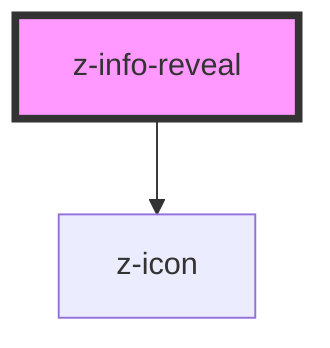

# z-info-reveal

Interactive info panel used to show short sentences, one at a time. The initial (closed) state always displays a custom icon and may contain a text label.

All the inner content is provided from the product.

<!-- Auto Generated Below -->

## Overview

Info reveal component.

## Properties

| Property    | Attribute    | Description                                                                                                                                                                                                                                                                             | Type                                                                                                                               | Default                           |
| ----------- | ------------ | --------------------------------------------------------------------------------------------------------------------------------------------------------------------------------------------------------------------------------------------------------------------------------------- | ---------------------------------------------------------------------------------------------------------------------------------- | --------------------------------- |
| `ariaLabel` | `aria-label` | Aria label of the trigger button. It will be only used when `label` prop is empty.                                                                                                                                                                                                      | `string`                                                                                                                           | `"Apri pannello informazioni"`    |
| `icon`      | `icon`       | Name of the icon for the trigger button                                                                                                                                                                                                                                                 | `string`                                                                                                                           | `"informationsource"`             |
| `label`     | `label`      | Label of the trigger button.                                                                                                                                                                                                                                                            | `string`                                                                                                                           | `undefined`                       |
| `position`  | `position`   | The position of the z-info-reveal in the page. This helps to correctly place the info panel. The panel will grow in the opposite direction of the position. For example, with the default position `BOTTOM_RIGHT`, the panel will grow vertically upwards and horizontally to the left. | `InfoRevealPosition.BOTTOM_LEFT \| InfoRevealPosition.BOTTOM_RIGHT \| InfoRevealPosition.TOP_LEFT \| InfoRevealPosition.TOP_RIGHT` | `InfoRevealPosition.BOTTOM_RIGHT` |
| `size`      | `size`       | Size of the trigger button                                                                                                                                                                                                                                                              | `ControlSize.BIG \| ControlSize.SMALL \| ControlSize.X_SMALL`                                                                      | `ControlSize.BIG`                 |

## Slots

| Slot | Description                |
| ---- | -------------------------- |
|      | content of the info panel. |

## Dependencies

### Depends on

- [z-icon](../icons/z-icon)

### Graph

----------------------------------------------

*Built with [StencilJS](https://stenciljs.com/)*
