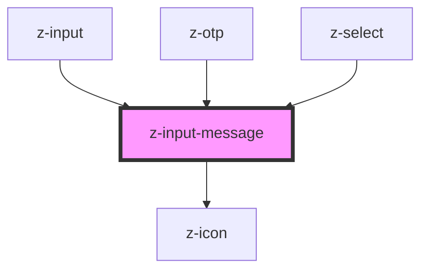

# z-input-message

<!-- Auto Generated Below -->

## Properties

| Property   | Attribute  | Description                                                           | Type                                                              | Default              |
| ---------- | ---------- | --------------------------------------------------------------------- | ----------------------------------------------------------------- | -------------------- |
| `disabled` | `disabled` | input disabled status (optional)                                      | `boolean`                                                         | `undefined`          |
| `htmlid`   | `htmlid`   | the id of the message element (optional)                              | `string`                                                          | ``id-${randomId()}`` |
| `message`  | `message`  | input helper message                                                  | `string`                                                          | `undefined`          |
| `status`   | `status`   | input status (optional)                                               | `InputStatus.ERROR \| InputStatus.SUCCESS \| InputStatus.WARNING` | `undefined`          |
| `withrole` | `withrole` | set role=alert if the message and the status are populated (optional) | `boolean`                                                         | `true`               |

## Dependencies

### Used by

 - [z-input](../z-input)
 - [z-otp](../../snowflakes/myz/z-otp)
 - [z-select](../z-select)

### Depends on

- [z-icon](../z-icon)

### Graph

```mermaid
graph TD;
  z-input-message --> z-icon
  z-input --> z-input-message
  z-otp --> z-input-message
  z-select --> z-input-message
  style z-input-message fill:#f9f,stroke:#333,stroke-width:4px
```

----------------------------------------------

*Built with [StencilJS](https://stenciljs.com/)*
