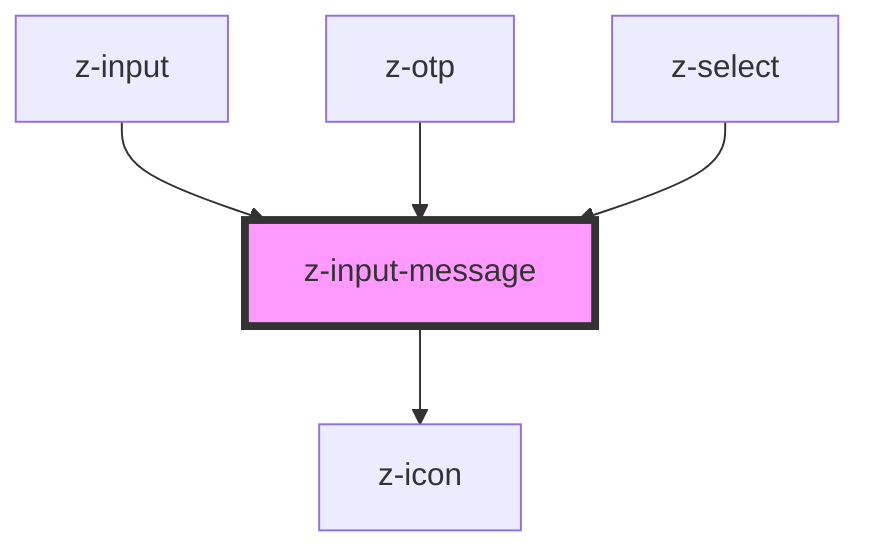

# z-input-message

<!-- Auto Generated Below -->

## Properties

| Property  | Attribute | Description             | Type                                                              | Default     |
| --------- | --------- | ----------------------- | ----------------------------------------------------------------- | ----------- |
| `message` | `message` | input helper message    | `string`                                                          | `undefined` |
| `status`  | `status`  | input status (optional) | `InputStatus.ERROR \| InputStatus.SUCCESS \| InputStatus.WARNING` | `undefined` |

## Dependencies

### Used by

 - [z-input](../z-input)
 - [z-otp](../../snowflakes/myz/z-otp)
 - [z-select](../z-select)

### Depends on

- [z-icon](../z-icon)

### Graph

----------------------------------------------

*Built with [StencilJS](https://stenciljs.com/)*
