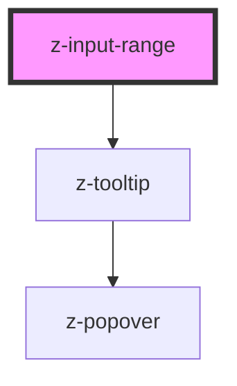

# z-input-range

<!-- Auto Generated Below -->

## Overview

Input range component.

## Properties

| Property        | Attribute         | Description                                                                                                                                                                                                                                                                                                                                                                                                                                                                | Type                                                                                             | Default                             |
| --------------- | ----------------- | -------------------------------------------------------------------------------------------------------------------------------------------------------------------------------------------------------------------------------------------------------------------------------------------------------------------------------------------------------------------------------------------------------------------------------------------------------------------------- | ------------------------------------------------------------------------------------------------ | ----------------------------------- |
| `disabled`      | `disabled`        | Whether the input range is disabled.                                                                                                                                                                                                                                                                                                                                                                                                                                       | `boolean`                                                                                        | `false`                             |
| `htmlAriaLabel` | `html-aria-label` | The aria label of the input range. for accessibility. Not necessary if the `label` prop is set.                                                                                                                                                                                                                                                                                                                                                                            | `string`                                                                                         | `undefined`                         |
| `htmlId`        | `html-id`         | ID of the input range.                                                                                                                                                                                                                                                                                                                                                                                                                                                     | `string`                                                                                         | `` `z-input-range-${randomId()}` `` |
| `label`         | `label`           | The label of the input range. When `orientation` is set to `vertical`, the label is not visible but used as `aria-label`, unless `htmlAriaLabel` is provided.                                                                                                                                                                                                                                                                                                              | `string`                                                                                         | `undefined`                         |
| `max`           | `max`             | The greatest value in the range of permitted values.                                                                                                                                                                                                                                                                                                                                                                                                                       | `number`                                                                                         | `100`                               |
| `min`           | `min`             | The lowest value in the range of permitted values.                                                                                                                                                                                                                                                                                                                                                                                                                         | `number`                                                                                         | `0`                                 |
| `orientation`   | `orientation`     | The orientation of the input range.                                                                                                                                                                                                                                                                                                                                                                                                                                        | `Orientation.HORIZONTAL \| Orientation.VERTICAL`                                                 | `undefined`                         |
| `showEdges`     | `show-edges`      | Whether to show `min` and `max` values of the input range. Only visible with the `horizontal` orientation.                                                                                                                                                                                                                                                                                                                                                                 | `boolean`                                                                                        | `false`                             |
| `size`          | `size`            | The size of the input range. Default: `ControlSize.BIG`                                                                                                                                                                                                                                                                                                                                                                                                                    | `ControlSize.BIG`                                                                                | `undefined`                         |
| `step`          | `step`            | The step value for the input range.                                                                                                                                                                                                                                                                                                                                                                                                                                        | `number`                                                                                         | `1`                                 |
| `value`         | `value`           | The value of the input range.                                                                                                                                                                                                                                                                                                                                                                                                                                              | `number`                                                                                         | `0`                                 |
| `valuePosition` | `value-position`  | The position of the tooltip displaying the current value. Defaults to `top` for horizontal orientation and `left` for vertical orientation. May be necessary to adjust this prop when the input range is close to the edges of the screen, to prevent the tooltip from showing out of the screen or in an unintended position due to auto adjustment. For example, for a horizontal input range close to the top of the screen, you may want to set this prop to `bottom`. | `PopoverPosition.BOTTOM \| PopoverPosition.LEFT \| PopoverPosition.RIGHT \| PopoverPosition.TOP` | `undefined`                         |

## Events

| Event         | Description                                                                        | Type                  |
| ------------- | ---------------------------------------------------------------------------------- | --------------------- |
| `rangeChange` | Emitted when the value of the input range has changed (`change` native event).     | `CustomEvent<number>` |
| `rangeInput`  | Emitted when the value of the input range is being changed (`input` native event). | `CustomEvent<number>` |

## Dependencies

### Depends on

- [z-tooltip](../z-tooltip)

### Graph

----------------------------------------------

*Built with [StencilJS](https://stenciljs.com/)*
