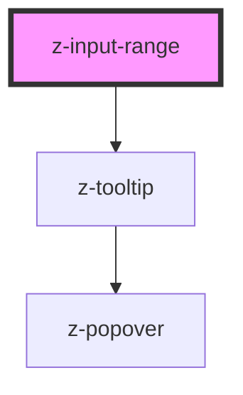

# z-input-range

<!-- Auto Generated Below -->

## Overview

Input range component.

## Properties

| Property              | Attribute               | Description                                                                                                                                                                                                                                                                                                                                                                                                                | Type                                                                                                                                                                                                                                                                                                                                                                     | Default               |
| --------------------- | ----------------------- | -------------------------------------------------------------------------------------------------------------------------------------------------------------------------------------------------------------------------------------------------------------------------------------------------------------------------------------------------------------------------------------------------------------------------- | ------------------------------------------------------------------------------------------------------------------------------------------------------------------------------------------------------------------------------------------------------------------------------------------------------------------------------------------------------------------------ | --------------------- |
| `disabled`            | `disabled`              | Whether the input range is disabled.                                                                                                                                                                                                                                                                                                                                                                                       | `boolean`                                                                                                                                                                                                                                                                                                                                                                | `false`               |
| `invertEdgesPosition` | `invert-edges-position` | Whether to invert the position of the edges. By default the edges are positioned beneath the input range for horizontal orientation and to the right for vertical orientation. When this prop is `true`, the edges are positioned above the input range for horizontal orientation and to the left for vertical orientation. Useful to prevent the tooltip from overlapping with the edges.                                | `boolean`                                                                                                                                                                                                                                                                                                                                                                | `false`               |
| `max`                 | `max`                   | The greatest value in the range of permitted values.                                                                                                                                                                                                                                                                                                                                                                       | `number`                                                                                                                                                                                                                                                                                                                                                                 | `100`                 |
| `min`                 | `min`                   | The lowest value in the range of permitted values.                                                                                                                                                                                                                                                                                                                                                                         | `number`                                                                                                                                                                                                                                                                                                                                                                 | `0`                   |
| `orientation`         | `orientation`           | The orientation of the input range.                                                                                                                                                                                                                                                                                                                                                                                        | `Orientation.HORIZONTAL \| Orientation.VERTICAL`                                                                                                                                                                                                                                                                                                                         | `undefined`           |
| `showEdges`           | `show-edges`            | Whether to show `min` and `max` values of the input range. Only visible with the `horizontal` orientation.                                                                                                                                                                                                                                                                                                                 | `boolean`                                                                                                                                                                                                                                                                                                                                                                | `false`               |
| `showValue`           | `show-value`            | Whether to always show the tooltip with the current value. When `false`, the tooltip is only shown on focus and when dragging the slider's thumb.                                                                                                                                                                                                                                                                          | `boolean`                                                                                                                                                                                                                                                                                                                                                                | `false`               |
| `size`                | `size`                  | The size of the input range. Default: `ControlSize.BIG`                                                                                                                                                                                                                                                                                                                                                                    | `ControlSize.BIG`                                                                                                                                                                                                                                                                                                                                                        | `undefined`           |
| `step`                | `step`                  | The step value for the input range.                                                                                                                                                                                                                                                                                                                                                                                        | `number`                                                                                                                                                                                                                                                                                                                                                                 | `1`                   |
| `value`               | `value`                 | The value of the input range.                                                                                                                                                                                                                                                                                                                                                                                              | `number`                                                                                                                                                                                                                                                                                                                                                                 | `0`                   |
| `valuePosition`       | `value-position`        | The position of the tooltip displaying the current value. Defaults to `top` for horizontal orientation and `left` for vertical orientation. May be necessary to adjust this prop when the input range is close to the edges of the screen, to prevent the tooltip from showing in unwanted positions. For example, for a horizontal input range close to the top of the screen, you may want to set this prop to `bottom`. | `PopoverPosition.AUTO \| PopoverPosition.BOTTOM \| PopoverPosition.BOTTOM_LEFT \| PopoverPosition.BOTTOM_RIGHT \| PopoverPosition.LEFT \| PopoverPosition.LEFT_BOTTOM \| PopoverPosition.LEFT_TOP \| PopoverPosition.RIGHT \| PopoverPosition.RIGHT_BOTTOM \| PopoverPosition.RIGHT_TOP \| PopoverPosition.TOP \| PopoverPosition.TOP_LEFT \| PopoverPosition.TOP_RIGHT` | `PopoverPosition.TOP` |

## Events

| Event         | Description                                                                        | Type                  |
| ------------- | ---------------------------------------------------------------------------------- | --------------------- |
| `rangeChange` | Emitted when the value of the input range has changed (`change` native event).     | `CustomEvent<number>` |
| `rangeInput`  | Emitted when the value of the input range is being changed (`input` native event). | `CustomEvent<number>` |

## Dependencies

### Depends on

- [z-tooltip](../z-tooltip)

### Graph

----------------------------------------------

*Built with [StencilJS](https://stenciljs.com/)*
