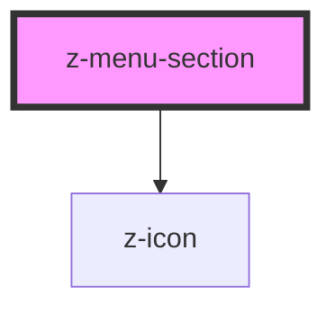

# z-menu-section

<!-- Auto Generated Below -->

## Overview

A component to create submenus inside the ZMenu.

## Properties

| Property       | Attribute       | Description                                                                                                                                                    | Type      | Default     |
| -------------- | --------------- | -------------------------------------------------------------------------------------------------------------------------------------------------------------- | --------- | ----------- |
| `active`       | `active`        | Active state                                                                                                                                                   | `boolean` | `undefined` |
| `htmlTabindex` | `html-tabindex` | Tabindex value to set on the label button. Useful to manage keyboard navigation focus with roving tabindex handled by this component's parent (usually ZMenu). | `number`  | `-1`        |
| `open`         | `open`          | The opening state of the section.                                                                                                                              | `boolean` | `undefined` |

## Events

| Event    | Description                  | Type               |
| -------- | ---------------------------- | ------------------ |
| `closed` | The section has been closed. | `CustomEvent<any>` |
| `opened` | The section has been opened. | `CustomEvent<any>` |

## Methods

### `focusLastItem() => Promise<void>`

Focus the last item.

#### Returns

Type: `Promise<void>`

### `setFocus() => Promise<void>`

Set tabindex of the label to 0, then focus it.

#### Returns

Type: `Promise<void>`

## Slots

| Slot     | Description                                                                                                                                               |
| -------- | --------------------------------------------------------------------------------------------------------------------------------------------------------- |
|          | Label of the menu section.                                                                                                                                |
| `"item"` | Single entry of the section. Set the same slot name to different items to put many of them. Add the `active` attribute to a slotted item to highlight it. |

## Dependencies

### Depends on

- [z-icon](../z-icon)

### Graph

----------------------------------------------

*Built with [StencilJS](https://stenciljs.com/)*
