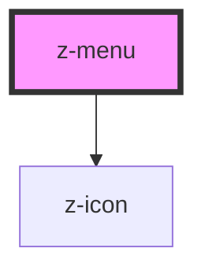

# z-menu

<!-- Auto Generated Below -->

## Properties

| Property          | Attribute          | Description                                                                                                                                                                                   | Type      | Default     |
| ----------------- | ------------------ | --------------------------------------------------------------------------------------------------------------------------------------------------------------------------------------------- | --------- | ----------- |
| `active`          | `active`           | Flag to set the active status of the menu.                                                                                                                                                    | `boolean` | `undefined` |
| `floating`        | `floating`         | Flag to set the display mode of the list. If true, the list will be absolutely positioned under the menu label, stacked beneath it otherwise.                                                 | `boolean` | `true`      |
| `htmlTabindex`    | `html-tabindex`    | Tabindex value to set on the menu label. Useful to manage keyboard navigation focus with roving tabindex handled by this component's parent (usually ZAppHeader).                             | `number`  | `-1`        |
| `open`            | `open`             | The opening state of the menu.                                                                                                                                                                | `boolean` | `false`     |
| `verticalContext` | `vertical-context` | Tells the component that it's placed in a vertical context with other `ZMenu`s (usually in the ZAppHeader's offcanvas). A small border is placed under it as a separator from other elements. | `boolean` | `false`     |

## Events

| Event    | Description               | Type               |
| -------- | ------------------------- | ------------------ |
| `closed` | The menu has been closed. | `CustomEvent<any>` |
| `opened` | The menu has been opened. | `CustomEvent<any>` |

## Methods

### `focusLastItem() => Promise<void>`

Focus the last item.

#### Returns

Type: `Promise<void>`

### `setFocus() => Promise<void>`

Set tabindex of the label to 0, then focus it.

#### Returns

Type: `Promise<void>`

## Slots

| Slot       | Description                                                                                                                                                                                                                                             |
| ---------- | ------------------------------------------------------------------------------------------------------------------------------------------------------------------------------------------------------------------------------------------------------- |
|            | Menu label                                                                                                                                                                                                                                              |
| `"header"` | Header to display as the first entry of the open menu.                                                                                                                                                                                                  |
| `"item"`   | Single entry of the section. Can be slotted multiple times to insert items onto the menu. Set the `data-active` HTML attribute on the element to highlight it (`active` also works but `data-active` is preferable). Use `z-menu-section` for submenus. |

## Dependencies

### Depends on

- [z-icon](../z-icon)

### Graph

----------------------------------------------

*Built with [StencilJS](https://stenciljs.com/)*
