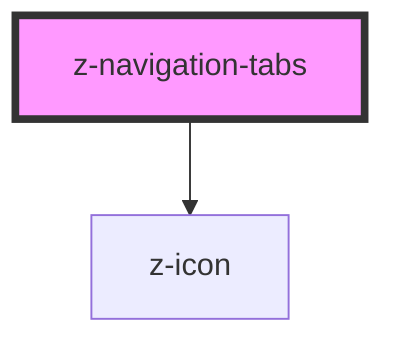

# z-navigation-tabs

<!-- Auto Generated Below -->

## Overview

Navigation tabs component.
To select a specific tab programmatically, set the `aria-selected` attribute to `true` on the desired tab.

## Properties

| Property      | Attribute      | Description                                                                                                                                                             | Type                                                                         | Default                                |
| ------------- | -------------- | ----------------------------------------------------------------------------------------------------------------------------------------------------------------------- | ---------------------------------------------------------------------------- | -------------------------------------- |
| `ariaLabel`   | `aria-label`   | Set `aria-label` attribute to the internal `<nav>` element with `tablist` role.                                                                                         | `string`                                                                     | `""`                                   |
| `orientation` | `orientation`  | Navigation tabs orientation.                                                                                                                                            | `NavigationTabsOrientation.HORIZONTAL \| NavigationTabsOrientation.VERTICAL` | `NavigationTabsOrientation.HORIZONTAL` |
| `selectedTab` | `selected-tab` | Index of the selected tab. Useful to programmatically select a tab. The tab can also be selected by setting the `aria-selected` attribute to `true` on the desired tab. | `number`                                                                     | `undefined`                            |
| `size`        | `size`         | Navigation tabs size.                                                                                                                                                   | `NavigationTabsSize.BIG \| NavigationTabsSize.SMALL`                         | `NavigationTabsSize.BIG`               |

## Events

| Event      | Description                                                                                                     | Type                  |
| ---------- | --------------------------------------------------------------------------------------------------------------- | --------------------- |
| `selected` | Emitted when the selected tab changes. Contains the index of the new selected tab in the `detail` of the event. | `CustomEvent<number>` |

## Slots

| Slot | Description                                          |
| ---- | ---------------------------------------------------- |
|      | Main slot. Use `<button>` or `<a>` tags as children. |

## Dependencies

### Depends on

- [z-icon](../z-icon)

### Graph

----------------------------------------------

*Built with [StencilJS](https://stenciljs.com/)*
