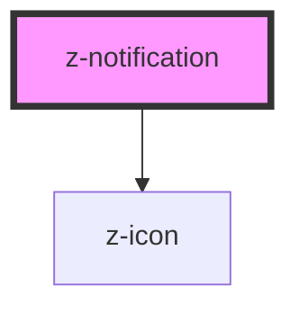

# z-notification

<!-- Auto Generated Below -->

## Overview

Notification bar component.

## Properties

| Property          | Attribute         | Description                                                                                                                                    | Type                                                                             | Default     |
| ----------------- | ----------------- | ---------------------------------------------------------------------------------------------------------------------------------------------- | -------------------------------------------------------------------------------- | ----------- |
| `actiontext`      | `actiontext`      | Action button text                                                                                                                             | `string`                                                                         | `undefined` |
| `borderposition`  | `borderposition`  | Border position                                                                                                                                | `"bottom" \| "top"`                                                              | `"bottom"`  |
| `contenticonname` | `contenticonname` | Name of the icon on the left of the content                                                                                                    | `string`                                                                         | `undefined` |
| `showclose`       | `showclose`       | Enable close icon                                                                                                                              | `boolean`                                                                        | `false`     |
| `showshadow`      | `showshadow`      | **[DEPRECATED]** shadow is available only for the `sticky` version of the notification.  Enable shadow. | `boolean`                                                                        | `false`     |
| `sticky`          | `sticky`          | Enable sticky notification bar.                                                                                                                | `boolean`                                                                        | `false`     |
| `type`            | `type`            | Alert variant type                                                                                                                             | `NotificationType.ERROR \| NotificationType.SUCCESS \| NotificationType.WARNING` | `undefined` |

## Events

| Event                | Description            | Type               |
| -------------------- | ---------------------- | ------------------ |
| `notificationAction` | Call to action clicked | `CustomEvent<any>` |
| `notificationClose`  | Close button clicked   | `CustomEvent<any>` |

## Slots

| Slot | Description                   |
| ---- | ----------------------------- |
|      | The text of the notification. |

## CSS Custom Properties

| Name                                  | Description                                                                                                                                                                                                                                                                                                                                                                        |
| ------------------------------------- | ---------------------------------------------------------------------------------------------------------------------------------------------------------------------------------------------------------------------------------------------------------------------------------------------------------------------------------------------------------------------------------- |
| `--z-notification--content-max-width` | The max width of the notification content. Useful to align the content with other elements on the page, keeping the colored background full width. Default: 100%. Note: the content is automatically centered, so if you want to limit the width only for the slotted content, you can wrap it in a container with the desired width and leave the `z-notification` width to 100%. |
| `--z-notification--inline-padding`    | The inline padding of the notification content. It can be useful to align the content when the `--z-notification--content-max-width` is set. Default: calc(var(--space-unit) * 2).                                                                                                                                                                                                 |
| `--z-notification--top-offset`        | The top offset of the notification. Use it when `sticky` prop is set to `true` and you need the notification to stay under other sticky elements. Default: 0px.                                                                                                                                                                                                                    |

## Dependencies

### Depends on

- [z-icon](../z-icon)

### Graph

----------------------------------------------

*Built with [StencilJS](https://stenciljs.com/)*
