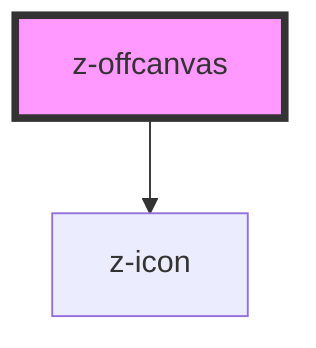

# z-offcanvas

<!-- Auto Generated Below -->

## Properties

| Property           | Attribute            | Description                            | Type     | Default          |
| ------------------ | -------------------- | -------------------------------------- | -------- | ---------------- |
| `closeButtonLabel` | `close-button-label` | aria-label for close button (optional) | `string` | `"close canvas"` |

## Events

| Event                   | Description                    | Type               |
| ----------------------- | ------------------------------ | ------------------ |
| `canvasBackgroundClick` | emitted on background click    | `CustomEvent<any>` |
| `canvasClose`           | emitted on close button click  | `CustomEvent<any>` |
| `canvasHeaderActive`    | emitted on canvas header click | `CustomEvent<any>` |

## Slots

| Slot                  | Description                   |
| --------------------- | ----------------------------- |
| `"canvasCloseButton"` | accept custom close button    |
| `"canvasContent"`     | set the content of the canvas |

## Dependencies

### Depends on

- [z-icon](../icons/z-icon)

### Graph

----------------------------------------------

*Built with [StencilJS](https://stenciljs.com/)*
