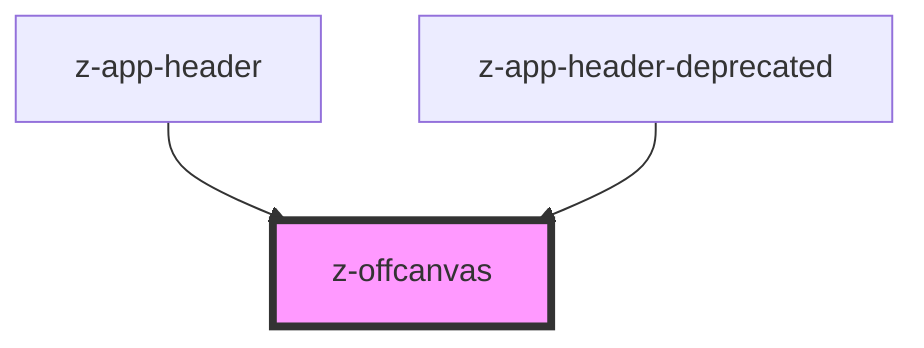

# z-offcanvas

[Abstract](https://app.abstract.com/share/9c363a6e-21fd-41a3-8458-7ea71ab4a477?collectionLayerId=68ca70b2-f3c1-4961-b56d-04775daea44e&mode=design)

## CSS Variables

- `--z-offcanvas--container-width`: set the minimum width of the canvas
- `--z-offcanvas--top-space`: set the top space left on top of the canvas in overlay variant

<!-- Auto Generated Below -->

## Properties

| Property              | Attribute             | Description                                                                                                                                                                         | Type                                                                              | Default                        |
| --------------------- | --------------------- | ----------------------------------------------------------------------------------------------------------------------------------------------------------------------------------- | --------------------------------------------------------------------------------- | ------------------------------ |
| `open`                | `open`                | Whether the offcanvas is open. Default: false                                                                                                                                       | `boolean`                                                                         | `false`                        |
| `transitiondirection` | `transitiondirection` | Open the content transitioning to a specified direction. The `up` direction always show the `overlay`, also when the variant is `pushcontent`.                                      | `TransitionDirection.LEFT \| TransitionDirection.RIGHT \| TransitionDirection.UP` | `TransitionDirection.LEFT`     |
| `variant`             | `variant`             | Offcanvas variant. - `overlay`: The offcanvas covers the page content putting an overlay. - `pushcontent`: The offcanvas isn't absolutely positioned and "pushes" the page content. | `OffCanvasVariant.OVERLAY \| OffCanvasVariant.PUSHCONTENT`                        | `OffCanvasVariant.PUSHCONTENT` |

## Events

| Event                     | Description                      | Type               |
| ------------------------- | -------------------------------- | ------------------ |
| `canvasOpenStatusChanged` | emitted when `open` prop changes | `CustomEvent<any>` |

## Slots

| Slot              | Description                     |
| ----------------- | ------------------------------- |
| `"canvasContent"` | Slot for the offcanvas content. |

## Dependencies

### Used by

 - [z-app-header](../z-app-header)
 - [z-app-header-deprecated](../deprecated/z-app-header-deprecated)

### Graph

----------------------------------------------

*Built with [StencilJS](https://stenciljs.com/)*
