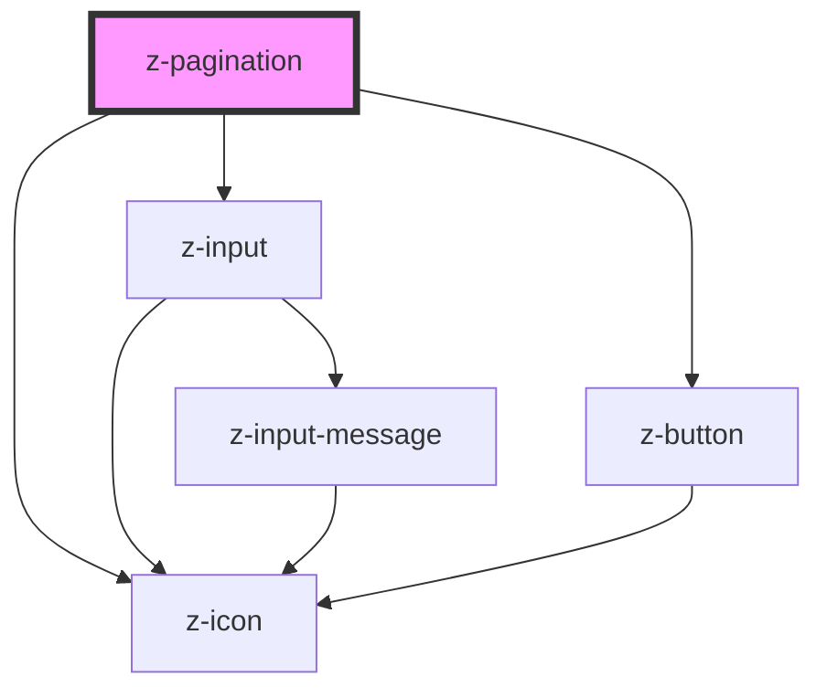

# z-pagination

<!-- Auto Generated Below -->

## Overview

Pagination bar component.

## Properties

| Property                  | Attribute       | Description                                                                               | Type      | Default     |
| ------------------------- | --------------- | ----------------------------------------------------------------------------------------- | --------- | ----------- |
| `currentPage`             | `current-page`  | Current page.                                                                             | `number`  | `1`         |
| `edges`                   | `edges`         | Enable buttons to go to the first and last pages.                                         | `boolean` | `false`     |
| `goToPage`                | `go-to-page`    | Whether to show "go to page" feature.                                                     | `boolean` | `undefined` |
| `label`                   | `label`         | Pagination label placed before the bar.                                                   | `string`  | `undefined` |
| `navArrows`               | `nav-arrows`    | Enable navigation arrows.                                                                 | `boolean` | `true`      |
| `skip`                    | `skip`          | Number of pages to skip.                                                                  | `number`  | `0`         |
| `split`                   | `split`         | Number of pages to show left/right of the current, before showing "load more" symbol (…). | `number`  | `undefined` |
| `totalPages` _(required)_ | `total-pages`   | Total number of pages. Required.                                                          | `number`  | `undefined` |
| `visiblePages`            | `visible-pages` | Number of pages to show at a time. If not set, all pages will be shown.                   | `number`  | `undefined` |

## Events

| Event         | Description                                      | Type               |
| ------------- | ------------------------------------------------ | ------------------ |
| `pageChanged` | Event emitted when the current page has changed. | `CustomEvent<any>` |

## Dependencies

### Depends on

- [z-icon](../z-icon)
- [z-input](../inputs/z-input)
- [z-button](../buttons/z-button)

### Graph

----------------------------------------------

*Built with [StencilJS](https://stenciljs.com/)*
