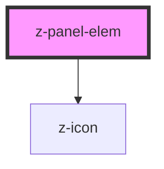

# z-panel-elem

<!-- readme-group="panel-element" -->

```html
<z-panel-elem
  linkicon="arrow-quad-down"
  linklabel="Tutte le prove"
  elemid="prova3"
  url="http://online.scuola.zanichelli.it/tutteleprove/"
/>
<z-panel-elem
  imgurl="https://staticdemomy.zanichelli.it/download/biblioteca.png"
  linkicon="arrow-quad-down"
  linklabel="Biblioteca"
  url="https://biblioteca.scuola.zanichelli.it/"
  elemid="prova1"
/>
<z-panel-elem
  isdisabled="true"
  imgurl="https://staticdemomy.zanichelli.it/download/biblioteca.png"
  linkicon="arrow-quad-down"
  linklabel="Tutte le prove"
  url="http://online.scuola.zanichelli.it/tutteleprove/"
  descr_slot_name="xxx1"
  elemid="prova2"
  >{descr_slot_name slot}</z-panel-elem
>
```

<!-- Auto Generated Below -->


## Properties

| Property        | Attribute         | Description                       | Type      | Default     |
| --------------- | ----------------- | --------------------------------- | --------- | ----------- |
| `descrSlotName` | `descr-slot-name` | name of slot container (optional) | `string`  | `undefined` |
| `elemid`        | `elemid`          | html element id (optional)        | `string`  | `undefined` |
| `imgalt`        | `imgalt`          | alternative image text (optional) | `string`  | `undefined` |
| `imgurl`        | `imgurl`          | image url source (optional)       | `string`  | `undefined` |
| `isdisabled`    | `isdisabled`      | disabled status flag (optional)   | `boolean` | `false`     |
| `linkicon`      | `linkicon`        | icon link name (optional)         | `string`  | `undefined` |
| `linklabel`     | `linklabel`       | link label text                   | `string`  | `undefined` |
| `target`        | `target`          | link target (optional)            | `string`  | `"_blank"`  |
| `url`           | `url`             | link url                          | `string`  | `undefined` |


## Slots

| Slot                | Description         |
| ------------------- | ------------------- |
| `"`descrSlotName`"` | description content |


## Dependencies

### Depends on

- [z-icon](../z-icon)

### Graph


----------------------------------------------

*Built with [StencilJS](https://stenciljs.com/)*
