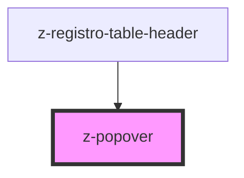

# z-popover

<!-- Auto Generated Below -->

## Properties

| Property          | Attribute          | Description                                   | Type                                                                                                                                                                                                                                                                                                                                                                                                                                                                                                    | Default                       |
| ----------------- | ------------------ | --------------------------------------------- | ------------------------------------------------------------------------------------------------------------------------------------------------------------------------------------------------------------------------------------------------------------------------------------------------------------------------------------------------------------------------------------------------------------------------------------------------------------------------------------------------------- | ----------------------------- |
| `backgroundColor` | `background-color` | [optional] Background color token for popover | `string`                                                                                                                                                                                                                                                                                                                                                                                                                                                                                                | `"color-white"`               |
| `borderRadius`    | `border-radius`    | [optional] Border radius token for popover    | `PopoverBorderRadius.medium \| PopoverBorderRadius.none \| PopoverBorderRadius.small`                                                                                                                                                                                                                                                                                                                                                                                                                   | `PopoverBorderRadius.small`   |
| `boxShadow`       | `box-shadow`       | [optional] Box shadow token for popover       | `typeof PopoverShadow["shadow-0"] \| typeof PopoverShadow["shadow-1"] \| typeof PopoverShadow["shadow-2"] \| typeof PopoverShadow["shadow-3"] \| typeof PopoverShadow["shadow-4"]`                                                                                                                                                                                                                                                                                                                      | `PopoverShadow["shadow-1"]`   |
| `position`        | `position`         | [optional] Popover position                   | `typeof PopoverPosition["above-center"] \| typeof PopoverPosition["above-left"] \| typeof PopoverPosition["above-right"] \| typeof PopoverPosition["after-center"] \| typeof PopoverPosition["after-down"] \| typeof PopoverPosition["after-up"] \| typeof PopoverPosition["before-center"] \| typeof PopoverPosition["before-down"] \| typeof PopoverPosition["before-up"] \| typeof PopoverPosition["below-center"] \| typeof PopoverPosition["below-left"] \| typeof PopoverPosition["below-right"]` | `PopoverPosition["after-up"]` |
| `showArrow`       | `show-arrow`       | [optional] Show or hide arrow                 | `boolean`                                                                                                                                                                                                                                                                                                                                                                                                                                                                                               | `false`                       |

## Dependencies

### Used by

 - [z-registro-table-header](../../snowflakes/registro-table/z-registro-table-header)

### Graph

----------------------------------------------

*Built with [StencilJS](https://stenciljs.com/)*
