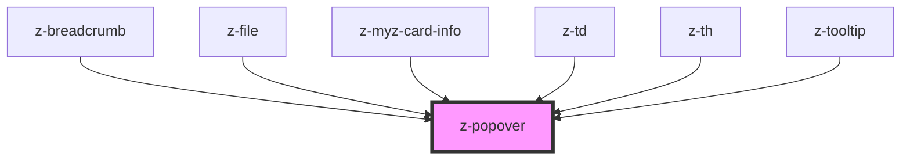

# z-popover

Use the `bindTo` property (`bind-to` in HTML) to bind the tooltip to an element, so the tooltip knows where to place itself. Its value can be a CSS selector or an HTMLElement.
If string css selector is provided make sure to use a valid selector according to the [standard](https://www.w3.org/TR/CSS21/syndata.html#characters).

You can use the `open` prop to show/hide the tooltip.

Maybe you want to know where the tooltip goes when the `position` is set to `auto`, so the `positionChange` event is fired when it changes its position.

To be sure the algorithm finds the right container, when calculating the position, set its position to `position: relative;`

<!-- readme-group="popover" -->

### Usage

```html
<z-popover
  type="top"
  bind-to="#popover-btn"
  open
>
  <span>Tooltip text</span>
</z-popover>
<button id="popover-btn">Button</button>
```

<!-- Auto Generated Below -->


## Overview

Popover component.

## Properties

| Property    | Attribute    | Description                                                                                                                                                                 | Type                                                                                                                                                                                                                                                                                                                                                                     | Default                |
| ----------- | ------------ | --------------------------------------------------------------------------------------------------------------------------------------------------------------------------- | ------------------------------------------------------------------------------------------------------------------------------------------------------------------------------------------------------------------------------------------------------------------------------------------------------------------------------------------------------------------------ | ---------------------- |
| `bindTo`    | `bind-to`    | The selector or the element bound with the popover. If string css selector is provided make sure to use a valid selector.                                                   | `HTMLElement \| string`                                                                                                                                                                                                                                                                                                                                                  | `undefined`            |
| `center`    | `center`     | Whether to center the popup on the main side (according to "position").                                                                                                     | `boolean`                                                                                                                                                                                                                                                                                                                                                                | `false`                |
| `closable`  | `closable`   | If true, the popover can be closed by clicking outside of it or pressing the escape key. Otherwise, it will be closed only programmatically (by setting `open` to `false`). | `boolean`                                                                                                                                                                                                                                                                                                                                                                | `true`                 |
| `open`      | `open`       | The open state of the popover.                                                                                                                                              | `boolean`                                                                                                                                                                                                                                                                                                                                                                | `false`                |
| `position`  | `position`   | Popover position.                                                                                                                                                           | `PopoverPosition.AUTO \| PopoverPosition.BOTTOM \| PopoverPosition.BOTTOM_LEFT \| PopoverPosition.BOTTOM_RIGHT \| PopoverPosition.LEFT \| PopoverPosition.LEFT_BOTTOM \| PopoverPosition.LEFT_TOP \| PopoverPosition.RIGHT \| PopoverPosition.RIGHT_BOTTOM \| PopoverPosition.RIGHT_TOP \| PopoverPosition.TOP \| PopoverPosition.TOP_LEFT \| PopoverPosition.TOP_RIGHT` | `PopoverPosition.AUTO` |
| `showArrow` | `show-arrow` | Whether to show popover's arrow.                                                                                                                                            | `boolean`                                                                                                                                                                                                                                                                                                                                                                | `false`                |


## Events

| Event            | Description            | Type               |
| ---------------- | ---------------------- | ------------------ |
| `openChange`     | Open change event.     | `CustomEvent<any>` |
| `positionChange` | Position change event. | `CustomEvent<any>` |


## Dependencies

### Used by

 - [z-breadcrumb](../z-breadcrumb)
 - [z-file](../file-upload/z-file)
 - [z-myz-card-info](../../snowflakes/myz/card/z-myz-card-info)
 - [z-td](../table/cells/z-td)
 - [z-th](../table/cells/z-th)
 - [z-tooltip](../notification/z-tooltip)

### Graph


----------------------------------------------

*Built with [StencilJS](https://stenciljs.com/)*
