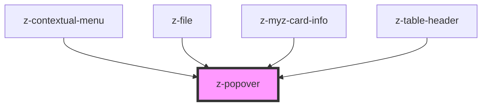

# z-popover
Use the `bindTo` property (`bind-to` in HTML) to bind the tooltip to an element, so the tooltip knows where to place itself. Its value can be a CSS selector or an HTMLElement.

You can use the `open` prop to show/hide the tooltip.

Maybe you want to know where the tooltip goes when the `position` is set to `auto`, so the `positionChange` event is fired when it changes its position.

To be sure the algorithm finds the right container, when calculating the position, set its position to `position: relative;`

<!-- readme-group="popover" -->
### Usage
```html
<z-popover type="top" bind-to="#popover-btn" open>
  <span>Tooltip text</span>
</z-popover>
<button id="popover-btn">Button</button>
```

<!-- Auto Generated Below -->


## Properties

| Property    | Attribute    | Description                                                          | Type                                                                                                                                                                                                                                                                                                                                                                                  | Default                 |
| ----------- | ------------ | -------------------------------------------------------------------- | ------------------------------------------------------------------------------------------------------------------------------------------------------------------------------------------------------------------------------------------------------------------------------------------------------------------------------------------------------------------------------------- | ----------------------- |
| `bindTo`    | `bind-to`    | The selector or the element bound with the popover.                  | `HTMLElement \| string`                                                                                                                                                                                                                                                                                                                                                               | `undefined`             |
| `center`    | `center`     | Whether center the popup on the main side - according to "position". | `boolean`                                                                                                                                                                                                                                                                                                                                                                             | `false`                 |
| `open`      | `open`       | The open state of the popover.                                       | `boolean`                                                                                                                                                                                                                                                                                                                                                                             | `false`                 |
| `position`  | `position`   | Popover position.                                                    | `PopoverPositions.AUTO \| PopoverPositions.BOTTOM \| PopoverPositions.BOTTOM_LEFT \| PopoverPositions.BOTTOM_RIGHT \| PopoverPositions.LEFT \| PopoverPositions.LEFT_BOTTOM \| PopoverPositions.LEFT_TOP \| PopoverPositions.RIGHT \| PopoverPositions.RIGHT_BOTTOM \| PopoverPositions.RIGHT_TOP \| PopoverPositions.TOP \| PopoverPositions.TOP_LEFT \| PopoverPositions.TOP_RIGHT` | `PopoverPositions.AUTO` |
| `showArrow` | `show-arrow` | Whether to show popover's arrow.                                     | `boolean`                                                                                                                                                                                                                                                                                                                                                                             | `false`                 |


## Events

| Event            | Description                                       | Type               |
| ---------------- | ------------------------------------------------- | ------------------ |
| `openChange`     | Open change event.                                | `CustomEvent<any>` |
| `positionChange` | Position change event.                            | `CustomEvent<any>` |
| `triggerClick`   | Emitted on popover click, returns isVisible state | `CustomEvent<any>` |


## Dependencies

### Used by

 - [z-contextual-menu](../z-contextual-menu)
 - [z-file](../file-upload/z-file)
 - [z-myz-card-info](../../snowflakes/myz/card/z-myz-card-info)
 - [z-table-header](../z-table/z-table-header)

### Graph


----------------------------------------------

*Built with [StencilJS](https://stenciljs.com/)*
