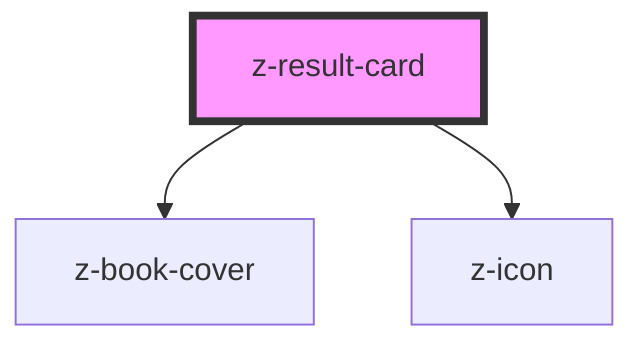

# z-result-card

<!-- Auto Generated Below -->

## Properties

| Property            | Attribute             | Description                                                        | Type      | Default     |
| ------------------- | --------------------- | ------------------------------------------------------------------ | --------- | ----------- |
| `authors`           | `authors`             | The authors of the opera.                                          | `string`  | `undefined` |
| `cardSubtitle`      | `card-subtitle`       | The subtitle of the card.                                          | `string`  | `undefined` |
| `cardTitle`         | `card-title`          | The title of the card.                                             | `string`  | `undefined` |
| `cover`             | `cover`               | The URL of the cover image of the opera.                           | `string`  | `undefined` |
| `fallbackCover`     | `fallback-cover`      | [optional] Fallback cover URL.                                     | `string`  | `undefined` |
| `hasMultipleCovers` | `has-multiple-covers` | Whether to show a stack of covers to represent multiple books.     | `boolean` | `false`     |
| `isInfoCard`        | `is-info-card`        | Enables the "info" variant of the card.                            | `boolean` | `false`     |
| `titleHtmlTag`      | `title-html-tag`      | [optional] Set a specific heading level as html tag for the title. | `string`  | `undefined` |

## Slots

| Slot        | Description                                                           |
| ----------- | --------------------------------------------------------------------- |
| `"tags"`    | slot containing the descriptors for the opera variant                 |
| `"volumes"` | slot containing the volume count to be displayed in the opera variant |

## Dependencies

### Depends on

- [z-book-cover](../z-book-cover)
- [z-icon](../z-icon)

### Graph

----------------------------------------------

*Built with [StencilJS](https://stenciljs.com/)*
