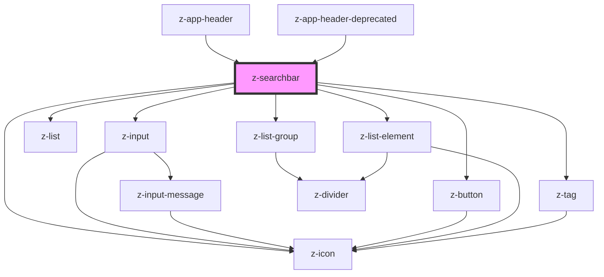

# z-searchbar

<!-- Auto Generated Below -->

## Properties

| Property               | Attribute                 | Description                                                                   | Type                                                                         | Default                     |
| ---------------------- | ------------------------- | ----------------------------------------------------------------------------- | ---------------------------------------------------------------------------- | --------------------------- |
| `autocomplete`         | `autocomplete`            | Show autocomplete results                                                     | `boolean`                                                                    | `false`                     |
| `autocompleteMinChars` | `autocomplete-min-chars`  | Minimun number of characters to dispatch typing event                         | `number`                                                                     | `3`                         |
| `htmlid`               | `htmlid`                  | the id of the searchbar element                                               | `string`                                                                     | ``searchbar-${randomId()}`` |
| `placeholder`          | `placeholder`             | Search input placeholder                                                      | `string`                                                                     | `undefined`                 |
| `preventSubmit`        | `prevent-submit`          | Prevent submit action                                                         | `boolean`                                                                    | `false`                     |
| `resultsCount`         | `results-count`           | Number of results shown - default all                                         | `number`                                                                     | `undefined`                 |
| `resultsItems`         | `results-items`           | Autocomplete results items                                                    | `SearchbarItem[] \| string`                                                  | `undefined`                 |
| `searchButtonIconOnly` | `search-button-icon-only` | Set button icon without label                                                 | `boolean`                                                                    | `false`                     |
| `searchHelperLabel`    | `search-helper-label`     | Search helper text                                                            | `string`                                                                     | `"Cerca {searchString}"`    |
| `showSearchButton`     | `show-search-button`      | Show submit button                                                            | `boolean`                                                                    | `false`                     |
| `size`                 | `size`                    | Available sizes: `big`, `small` and `x-small`. Defaults to `big`.             | `ControlSize.BIG \| ControlSize.SMALL \| ControlSize.X_SMALL`                | `ControlSize.BIG`           |
| `sortResultsItems`     | `sort-results-items`      | Sort autocomplete results items                                               | `boolean`                                                                    | `false`                     |
| `value`                | `value`                   | Input search string                                                           | `string`                                                                     | `undefined`                 |
| `variant`              | `variant`                 | Graphical variant: `primary`, `secondary`, `tertiary`. Defaults to `primary`. | `ButtonVariant.PRIMARY \| ButtonVariant.SECONDARY \| ButtonVariant.TERTIARY` | `ButtonVariant.PRIMARY`     |

## Events

| Event             | Description                                    | Type                                                                                                                                                                                                          |
| ----------------- | ---------------------------------------------- | ------------------------------------------------------------------------------------------------------------------------------------------------------------------------------------------------------------- |
| `searchItemClick` | Emitted on search result click, return item    | `CustomEvent<{ label: string; id?: string; icon?: string; tag?: { icon?: string; text: string; }; category?: string; subcategory?: string; children?: Omit<SearchbarItem, "category" \| "subcategory">[]; }>` |
| `searchSubmit`    | Emitted on search submit, return search string | `CustomEvent<string>`                                                                                                                                                                                         |
| `searchTyping`    | Emitted on search typing, return search string | `CustomEvent<string>`                                                                                                                                                                                         |

## Dependencies

### Used by

 - [z-app-header](../z-app-header)
 - [z-app-header-deprecated](../deprecated/z-app-header-deprecated)

### Depends on

- [z-input](../z-input)
- [z-button](../z-button)
- [z-list](../list/z-list)
- [z-list-group](../list/z-list-group)
- [z-list-element](../list/z-list-element)
- [z-icon](../z-icon)
- [z-tag](../z-tag)

### Graph

----------------------------------------------

*Built with [StencilJS](https://stenciljs.com/)*
