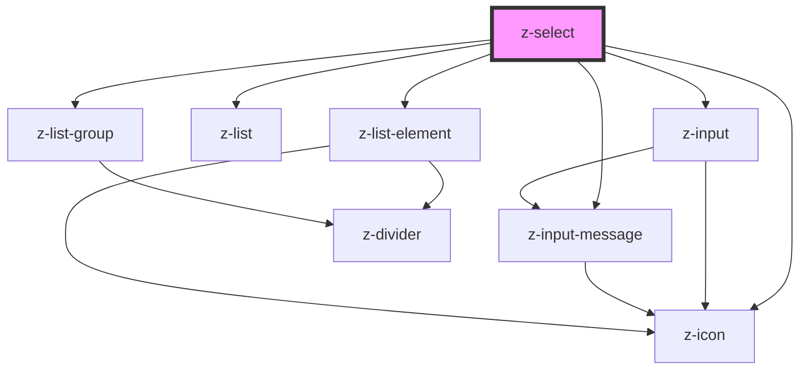

# z-select

<!-- Auto Generated Below -->

## Properties

| Property         | Attribute         | Description                                                                    | Type                                                              | Default              |
| ---------------- | ----------------- | ------------------------------------------------------------------------------ | ----------------------------------------------------------------- | -------------------- |
| `ariaLabel`      | `aria-label`      | the input aria-label                                                           | `string`                                                          | `""`                 |
| `autocomplete`   | `autocomplete`    | the input has autocomplete option                                              | `boolean`                                                         | `false`              |
| `disabled`       | `disabled`        | the input is disabled                                                          | `boolean`                                                         | `false`              |
| `hasGroupItems`  | `has-group-items` |                                                                                | `boolean`                                                         | `undefined`          |
| `htmlid`         | `htmlid`          | the id of the input element                                                    | `string`                                                          | ``id-${randomId()}`` |
| `htmltitle`      | `htmltitle`       | the input html title (optional)                                                | `string`                                                          | `undefined`          |
| `isfixed`        | `isfixed`         | When fixed, it occupies space and pushes down next elements.                   | `boolean`                                                         | `false`              |
| `items`          | `items`           | the input select options                                                       | `SelectItem[] \| string`                                          | `undefined`          |
| `label`          | `label`           | the input label                                                                | `string`                                                          | `undefined`          |
| `message`        | `message`         | input helper message (optional) - if set to `false` message won't be displayed | `boolean \| string`                                               | `true`               |
| `name`           | `name`            | the input name                                                                 | `string`                                                          | `undefined`          |
| `noresultslabel` | `noresultslabel`  | no result text message                                                         | `string`                                                          | `"Nessun risultato"` |
| `placeholder`    | `placeholder`     | the input placeholder (optional)                                               | `string`                                                          | `undefined`          |
| `readonly`       | `readonly`        | the input is readonly                                                          | `boolean`                                                         | `false`              |
| `resetItem`      | `reset-item`      |                                                                                | `string`                                                          | `undefined`          |
| `size`           | `size`            | Available sizes: `big`, `small` and `x-small`. Defaults to `big`.              | `ControlSize.BIG \| ControlSize.SMALL \| ControlSize.X_SMALL`     | `ControlSize.BIG`    |
| `status`         | `status`          | the input status (optional)                                                    | `InputStatus.ERROR \| InputStatus.SUCCESS \| InputStatus.WARNING` | `undefined`          |

## Events

| Event          | Description                                                             | Type               |
| -------------- | ----------------------------------------------------------------------- | ------------------ |
| `optionSelect` | Emitted on select option selection, returns select id, selected item id | `CustomEvent<any>` |
| `resetSelect`  | Emitted on reset selected item, returns select id, selected item id     | `CustomEvent<any>` |

## Methods

### `getSelectedItem() => Promise<SelectItem>`

get the input selected options

#### Returns

Type: `Promise<SelectItem>`

### `getValue() => Promise<string>`

get the input value

#### Returns

Type: `Promise<string>`

### `setValue(value: string | string[]) => Promise<void>`

set the input value

#### Parameters

| Name    | Type                 | Description |
| ------- | -------------------- | ----------- |
| `value` | `string \| string[]` |             |

#### Returns

Type: `Promise<void>`

## Dependencies

### Depends on

- [z-input](../z-input)
- [z-list](../list/z-list)
- [z-list-element](../list/z-list-element)
- [z-icon](../z-icon)
- [z-list-group](../list/z-list-group)
- [z-input-message](../z-input-message)

### Graph

----------------------------------------------

*Built with [StencilJS](https://stenciljs.com/)*
