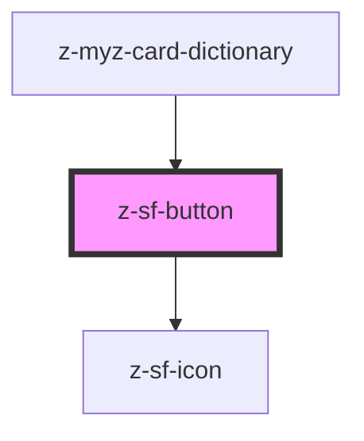

# z-sf-button

<!-- Auto Generated Below -->

## Properties

| Property         | Attribute          | Description                                                                                                                                                     | Type                                                                                                                                  | Default                   |
| ---------------- | ------------------ | --------------------------------------------------------------------------------------------------------------------------------------------------------------- | ------------------------------------------------------------------------------------------------------------------------------------- | ------------------------- |
| `SfIconPosition` | `sf-icon-position` | the button icon position. Defaults to `left`                                                                                                                    | `SfIconPosition.LEFT \| SfIconPosition.RIGHT`                                                                                         | `SfIconPosition.LEFT`     |
| `ariaLabel`      | `aria-label`       | defines a string value that labels the internal interactive element. Used for accessibility.                                                                    | `string`                                                                                                                              | `undefined`               |
| `disabled`       | `disabled`         | HTML button disabled attribute.                                                                                                                                 | `boolean`                                                                                                                             | `false`                   |
| `href`           | `href`             | HTML <a> href attribute. If it is set, it renders an HTML <a> tag.                                                                                              | `string`                                                                                                                              | `undefined`               |
| `htmlid`         | `htmlid`           | Identifier, should be unique.                                                                                                                                   | `string`                                                                                                                              | `undefined`               |
| `htmlrole`       | `htmlrole`         | defines role attribute, used for accessibility.                                                                                                                 | `string`                                                                                                                              | `undefined`               |
| `icon`           | `icon`             | `z-sf-icon` name to use (optional).                                                                                                                             | `string`                                                                                                                              | `undefined`               |
| `name`           | `name`             | HTML button name attribute.                                                                                                                                     | `string`                                                                                                                              | `undefined`               |
| `role`           | `role`             | **[DEPRECATED]** This prop has been deprecated in favor of `htmlrole` for better accessibility.  Use `htmlrole` instead. | `string`                                                                                                                              | `""`                      |
| `size`           | `size`             | Available sizes: `big`, `small` and `x-small`. Defaults to `big`.                                                                                               | `SfButtonSize.BIG \| SfButtonSize.SMALL \| SfButtonSize.X_SMALL \| SfControlSize.BIG \| SfControlSize.SMALL \| SfControlSize.X_SMALL` | `SfControlSize.BIG`       |
| `target`         | `target`           | HTML a target attribute.                                                                                                                                        | `string`                                                                                                                              | `undefined`               |
| `type`           | `type`             | HTML button type attribute.                                                                                                                                     | `SfButtonType.BUTTON \| SfButtonType.RESET \| SfButtonType.SUBMIT`                                                                    | `SfButtonType.BUTTON`     |
| `variant`        | `variant`          | Graphical variant: `primary`, `secondary`, `tertiary`. Defaults to `primary`.                                                                                   | `SfButtonVariant.PRIMARY \| SfButtonVariant.SECONDARY \| SfButtonVariant.TERTIARY`                                                    | `SfButtonVariant.PRIMARY` |

## Slots

| Slot | Description  |
| ---- | ------------ |
|      | button label |

## Dependencies

### Used by

 - [z-myz-card-dictionary](../../snowflakes/myz/card/z-myz-card-dictionary)

### Depends on

- [z-sf-icon](../z-sf-icon)

### Graph

----------------------------------------------

*Built with [StencilJS](https://stenciljs.com/)*
