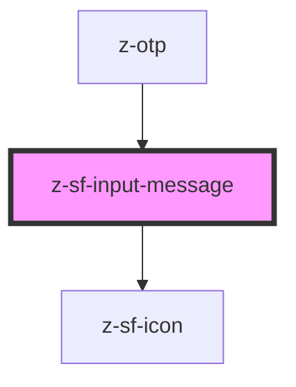

# z-sf-input-message

<!-- Auto Generated Below -->

## Properties

| Property   | Attribute   | Description                                                                   | Type                                                                    | Default                    |
| ---------- | ----------- | ----------------------------------------------------------------------------- | ----------------------------------------------------------------------- | -------------------------- |
| `disabled` | `disabled`  | input disabled status (optional)                                              | `boolean`                                                               | `undefined`                |
| `htmlId`   | `html-id`   | the id of the message element (optional)                                      | `string`                                                                | `` `id-${sfRandomId()}` `` |
| `htmlRole` | `html-role` | the role to set when both the message and the status are populated (optional) | `string`                                                                | `"alert"`                  |
| `message`  | `message`   | input helper message                                                          | `string`                                                                | `undefined`                |
| `status`   | `status`    | input status (optional)                                                       | `SfInputStatus.ERROR \| SfInputStatus.SUCCESS \| SfInputStatus.WARNING` | `undefined`                |

## Dependencies

### Used by

 - [z-otp](../../snowflakes/myz/z-otp)

### Depends on

- [z-sf-icon](../z-sf-icon)

### Graph

----------------------------------------------

*Built with [StencilJS](https://stenciljs.com/)*
