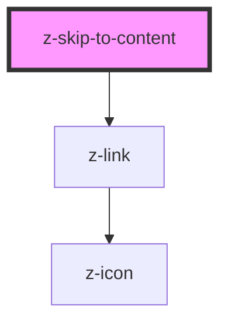

# z-skip-to-content

<!-- Auto Generated Below -->

## Properties

| Property  | Attribute | Description                          | Type                                      | Default     |
| --------- | --------- | ------------------------------------ | ----------------------------------------- | ----------- |
| `links`   | `links`   | Array to fill link into skip-content | `SkipToContentLink[] \| string`           | `[]`        |
| `variant` | `variant` | Graphical variant: `dark`, `light`.  | `ThemeVariant.dark \| ThemeVariant.light` | `undefined` |

## Dependencies

### Depends on

- [z-link](../navigation/z-link)

### Graph

----------------------------------------------

*Built with [StencilJS](https://stenciljs.com/)*
