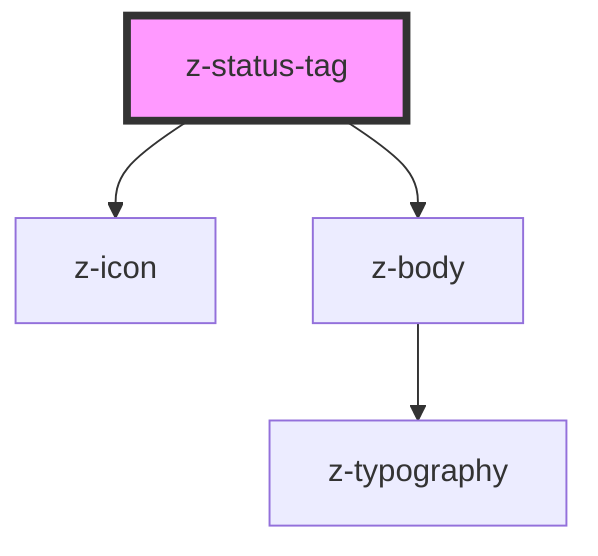

# z-status-tag

<!-- Auto Generated Below -->

## Properties

| Property     | Attribute    | Description                                   | Type                                                                                                           | Default                    |
| ------------ | ------------ | --------------------------------------------- | -------------------------------------------------------------------------------------------------------------- | -------------------------- |
| `expandable` | `expandable` | [optional] Hide the text and show it on hover | `boolean`                                                                                                      | `undefined`                |
| `icon`       | `icon`       | [optional] Status tag icon                    | `string`                                                                                                       | `undefined`                |
| `text`       | `text`       | [optional] Status tag text                    | `string`                                                                                                       | `undefined`                |
| `type`       | `type`       | [optional] Status tag color                   | `StatusTagType.blue \| StatusTagType.green \| StatusTagType.grey \| StatusTagType.red \| StatusTagType.yellow` | `StatusTagType.blue`       |
| `variant`    | `variant`    | [optional] Status tag style                   | `StatusTagVariant.dark \| StatusTagVariant.default \| StatusTagVariant.light`                                  | `StatusTagVariant.default` |

## Dependencies

### Depends on

- [z-icon](../icons/z-icon)
- [z-body](../typography/z-body)

### Graph

----------------------------------------------

*Built with [StencilJS](https://stenciljs.com/)*
