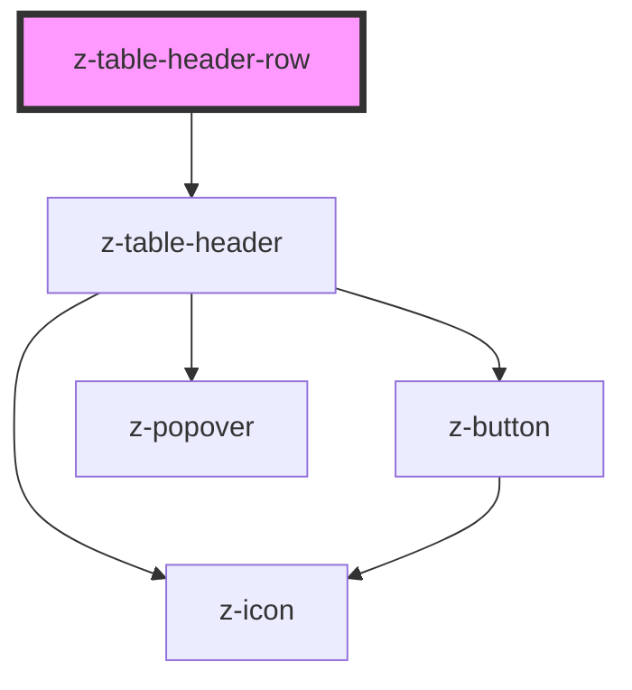

# z-table-header-row

<!-- Auto Generated Below -->

## Properties

| Property     | Attribute    | Description         | Type      | Default     |
| ------------ | ------------ | ------------------- | --------- | ----------- |
| `expandable` | `expandable` | Row expandable flag | `boolean` | `undefined` |

## Dependencies

### Depends on

- [z-table-header](../z-table-header)

### Graph

----------------------------------------------

*Built with [StencilJS](https://stenciljs.com/)*
