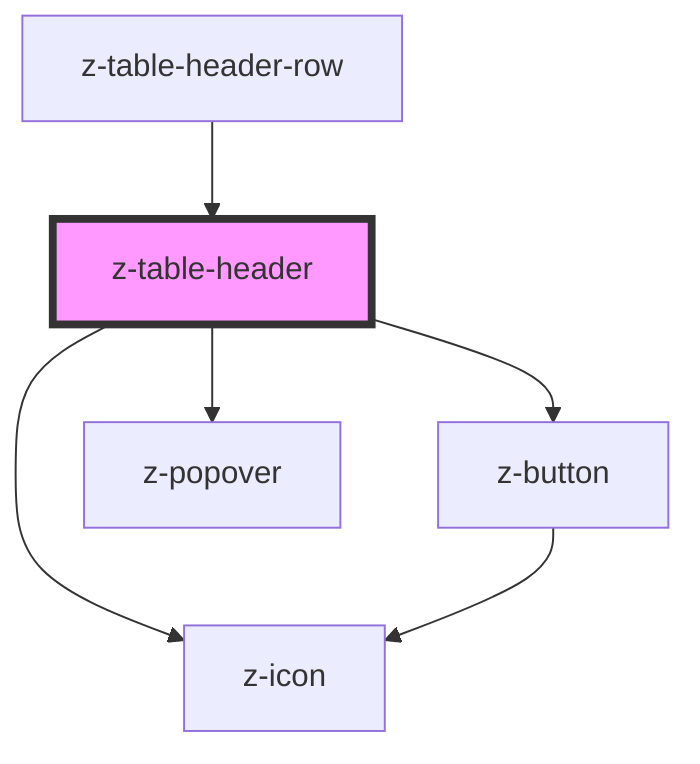

# z-table-header

<!-- Auto Generated Below -->

## Properties

| Property               | Attribute                | Description                                                  | Type                                                                                | Default                  |
| ---------------------- | ------------------------ | ------------------------------------------------------------ | ----------------------------------------------------------------------------------- | ------------------------ |
| `columnId`             | `column-id`              | Column ID                                                    | `string`                                                                            | `undefined`              |
| `defaultSortDirection` | `default-sort-direction` | [Optional] Default sort order                                | `SortDirectionEnum.asc \| SortDirectionEnum.desc \| SortDirectionEnum.none`         | `SortDirectionEnum.asc`  |
| `padding`              | `padding`                | Set padding size of cell, if special 0px padding will be set | `Size.large \| Size.medium \| Size.small \| Size.special \| typeof Size["x-small"]` | `Size.medium`            |
| `showButton`           | `show-button`            | [Optional] Show contextual menu button                       | `boolean`                                                                           | `undefined`              |
| `sortDirection`        | `sort-direction`         |                                                              | `SortDirectionEnum.asc \| SortDirectionEnum.desc \| SortDirectionEnum.none`         | `SortDirectionEnum.none` |
| `sortable`             | `sortable`               | [Optional] Make the header sortable                          | `boolean`                                                                           | `undefined`              |

## Events

| Event  | Description                     | Type               |
| ------ | ------------------------------- | ------------------ |
| `sort` | [Optional] callback for sorting | `CustomEvent<any>` |

## Dependencies

### Used by

- [z-table-header-row](../z-table-header-row)

### Depends on

- [z-icon](../../icons/z-icon)
- [z-button](../../buttons/z-button)
- [z-popover](../../z-popover)

### Graph

---

_Built with [StencilJS](https://stenciljs.com/)_
