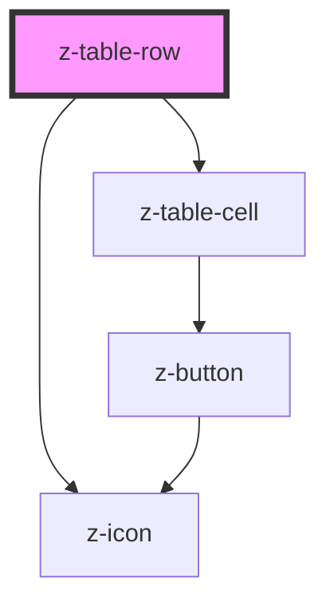

# z-registro-table-row

<!-- readme-group="registro-table" -->

```html
<z-registro-table-row></z-registro-table-row>
```

<!-- Auto Generated Below -->


## Properties

| Property       | Attribute       | Description | Type                                                                                              | Default                      |
| -------------- | --------------- | ----------- | ------------------------------------------------------------------------------------------------- | ---------------------------- |
| `expandedType` | `expanded-type` |             | `ZTableRowExpandedType.expandable \| ZTableRowExpandedType.none \| ZTableRowExpandedType.padding` | `ZTableRowExpandedType.none` |


## Events

| Event    | Description | Type               |
| -------- | ----------- | ------------------ |
| `expand` |             | `CustomEvent<any>` |


## Dependencies

### Depends on

- [z-table-cell](../z-table-cell)
- [z-icon](../../icons/z-icon)

### Graph


----------------------------------------------

*Built with [StencilJS](https://stenciljs.com/)*
