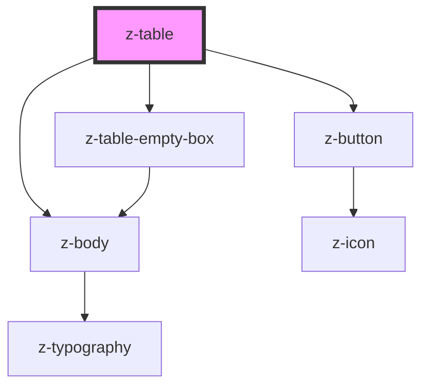

# z-table

<!-- Auto Generated Below -->

## Properties

| Property               | Attribute                  | Description                | Type      | Default                                                                   |
| ---------------------- | -------------------------- | -------------------------- | --------- | ------------------------------------------------------------------------- |
| `bordered`             | `bordered`                 | Sets table with border     | `boolean` | `false`                                                                   |
| `callToActionLabel`    | `call-to-action-label`     | Sets call to action label  | `string`  | `undefined`                                                               |
| `callToActionTwoLabel` | `call-to-action-two-label` | Sets call to action label  | `string`  | `undefined`                                                               |
| `columnSticky`         | `column-sticky`            | Sets first column sticky   | `boolean` | `false`                                                                   |
| `empty`                | `empty`                    | Sets empty table           | `boolean` | `false`                                                                   |
| `error`                | `error`                    | Set error status           | `boolean` | `false`                                                                   |
| `errorLink`            | `error-link`               | Set error status           | `string`  | `undefined`                                                               |
| `errorMessage`         | `error-message`            | Error message              | `string`  | `"Siamo spiacenti, non siamo riusciti a caricare il contenuto richiesto"` |
| `headerSticky`         | `header-sticky`            | Sets header sticky         | `boolean` | `false`                                                                   |
| `lines`                | `lines`                    | Number of lines of element | `number`  | `undefined`                                                               |
| `message`              | `message`                  | Set message                | `string`  | `"Siamo spiacenti, al momento non sono presenti dati da visualizzare"`    |
| `subtitle`             | `subtitle`                 | Set subtitle               | `string`  | `""`                                                                      |

## Events

| Event             | Description                 | Type               |
| ----------------- | --------------------------- | ------------------ |
| `callToAction`    | remove call to action event | `CustomEvent<any>` |
| `callToActionTwo` | remove call to action event | `CustomEvent<any>` |

## Slots

| Slot              | Description                          |
| ----------------- | ------------------------------------ |
|                   | table elements                       |
| `"sticky-footer"` | set the content of the sticky footer |

## Dependencies

### Depends on

- [z-body](../../typography/z-body)
- [z-table-empty-box](../z-table-empty-box)
- [z-button](../../buttons/z-button)

### Graph

----------------------------------------------

*Built with [StencilJS](https://stenciljs.com/)*
