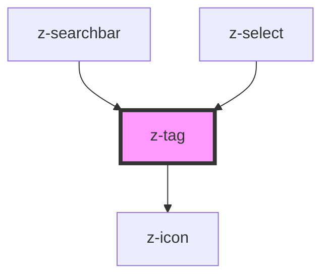

# z-tag

<!-- Auto Generated Below -->

## Overview

Ztag component.

## Properties

| Property     | Attribute    | Description                                   | Type      | Default     |
| ------------ | ------------ | --------------------------------------------- | --------- | ----------- |
| `expandable` | `expandable` | [optional] Hide the text and show it on hover | `boolean` | `undefined` |
| `icon`       | `icon`       | [optional] Tag icon                           | `string`  | `undefined` |

## Slots

| Slot | Description            |
| ---- | ---------------------- |
|      | The text of the z-tag. |

## Dependencies

### Used by

 - [z-searchbar](../z-searchbar)
 - [z-select](../z-select)

### Depends on

- [z-icon](../z-icon)

### Graph

----------------------------------------------

*Built with [StencilJS](https://stenciljs.com/)*
