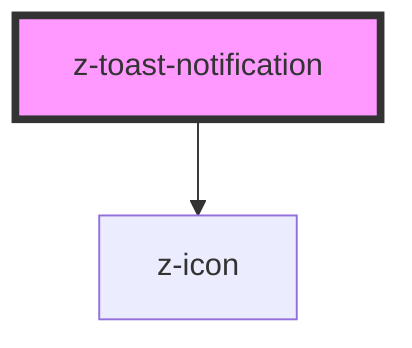

# z-toast-notification

<!-- Auto Generated Below -->

## Properties

| Property      | Attribute     | Description | Type                                                                                                                                                                                         | Default     |
| ------------- | ------------- | ----------- | -------------------------------------------------------------------------------------------------------------------------------------------------------------------------------------------- | ----------- |
| `autoclose`   | `autoclose`   |             | `number`                                                                                                                                                                                     | `undefined` |
| `closebutton` | `closebutton` |             | `boolean`                                                                                                                                                                                    | `undefined` |
| `message`     | `message`     |             | `string`                                                                                                                                                                                     | `undefined` |
| `titolo`      | `titolo`      |             | `string`                                                                                                                                                                                     | `undefined` |
| `type`        | `type`        |             | `ToastNotificationEnum.accent \| ToastNotificationEnum.dark \| ToastNotificationEnum.error \| ToastNotificationEnum.light \| ToastNotificationEnum.success \| ToastNotificationEnum.warning` | `undefined` |

## Events

| Event         | Description              | Type               |
| ------------- | ------------------------ | ------------------ |
| `toastAction` |                          | `CustomEvent<any>` |
| `toastClose`  | notification close event | `CustomEvent<any>` |

## Dependencies

### Depends on

- [z-icon](../icons/z-icon)

### Graph

----------------------------------------------

*Built with [StencilJS](https://stenciljs.com/)*
