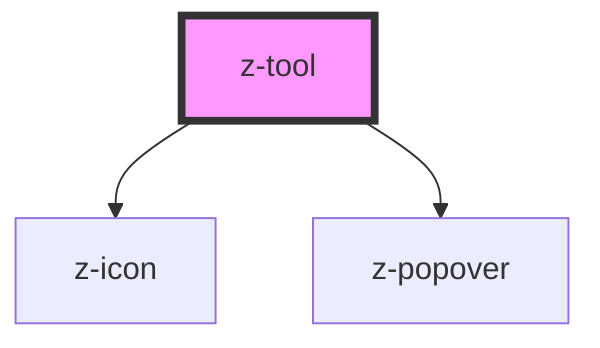

# z-tool

<!-- Auto Generated Below -->

## Overview

ZTool component.

## Properties

| Property          | Attribute          | Description                                                           | Type                                                                                                                                                                                                                                                                                                                                                                     | Default               |
| ----------------- | ------------------ | --------------------------------------------------------------------- | ------------------------------------------------------------------------------------------------------------------------------------------------------------------------------------------------------------------------------------------------------------------------------------------------------------------------------------------------------------------------ | --------------------- |
| `active`          | `active`           | Visual selected state.                                                | `boolean`                                                                                                                                                                                                                                                                                                                                                                | `false`               |
| `disabled`        | `disabled`         | Disabled state.                                                       | `boolean`                                                                                                                                                                                                                                                                                                                                                                | `false`               |
| `htmlAriaLabel`   | `html-aria-label`  | Accessible label for the tool trigger. Falls back to tooltip content. | `string`                                                                                                                                                                                                                                                                                                                                                                 | `undefined`           |
| `icon`            | `icon`             | Tool icon                                                             | `string`                                                                                                                                                                                                                                                                                                                                                                 | `undefined`           |
| `open`            | `open`             | Open state.                                                           | `boolean`                                                                                                                                                                                                                                                                                                                                                                | `false`               |
| `tooltip`         | `tooltip`          | Text displayed inside the tooltip.                                    | `string`                                                                                                                                                                                                                                                                                                                                                                 | `undefined`           |
| `tooltipPosition` | `tooltip-position` | Preferred tooltip position. Defaults to true.                         | `PopoverPosition.AUTO \| PopoverPosition.BOTTOM \| PopoverPosition.BOTTOM_LEFT \| PopoverPosition.BOTTOM_RIGHT \| PopoverPosition.LEFT \| PopoverPosition.LEFT_BOTTOM \| PopoverPosition.LEFT_TOP \| PopoverPosition.RIGHT \| PopoverPosition.RIGHT_BOTTOM \| PopoverPosition.RIGHT_TOP \| PopoverPosition.TOP \| PopoverPosition.TOP_LEFT \| PopoverPosition.TOP_RIGHT` | `PopoverPosition.TOP` |

## Events

| Event           | Description                          | Type               |
| --------------- | ------------------------------------ | ------------------ |
| `toggleSubmenu` | Emitted when the open state changes. | `CustomEvent<any>` |

## Slots

| Slot | Description                                                                                                |
| ---- | ---------------------------------------------------------------------------------------------------------- |
|      | Optional slot for nested content (e.g., a secondary z-toolbar) that appears when the tool is open/clicked. |

## Dependencies

### Depends on

- [z-icon](../z-icon)
- [z-popover](../z-popover)

### Graph

----------------------------------------------

*Built with [StencilJS](https://stenciljs.com/)*
