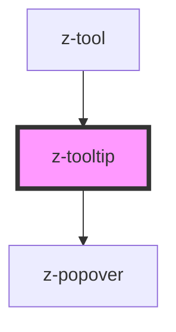

# z-tooltip

Use the `bindTo` property (`bind-to` in HTML) to bind the tooltip to an element, so the tooltip knows where to place itself. Its value can be a CSS selector or an HTMLElement.

You can use the `open` prop to show/hide the tooltip.

Maybe you want to know where the tooltip goes when the `position` is set to `auto`, so the `positionChange` event is fired when it changes its position.

To be sure the algorithm finds the right container, when calculating the position, set its position to `position: relative;`

<!-- readme-group="toltip" -->

### Usage

```html
<z-tooltip
  type="top"
  bind-to="#tooltip-btn"
  open
>
  <span>Tooltip text</span>
</z-tooltip>
<button id="tooltip-btn">Button</button>
```

<!-- Auto Generated Below -->


## Overview

Tooltip component.
It is basically a wrapper for the `<z-popover>` component with custom configuration.

## Properties

| Property   | Attribute  | Description                                                                                                                                                                                                            | Type                                                                                                                                                                                                                                                                                                                                                                     | Default                |
| ---------- | ---------- | ---------------------------------------------------------------------------------------------------------------------------------------------------------------------------------------------------------------------- | ------------------------------------------------------------------------------------------------------------------------------------------------------------------------------------------------------------------------------------------------------------------------------------------------------------------------------------------------------------------------ | ---------------------- |
| `bindTo`   | `bind-to`  | The selector or the element bound with the tooltip.                                                                                                                                                                    | `HTMLElement \| string`                                                                                                                                                                                                                                                                                                                                                  | `undefined`            |
| `closable` | `closable` | Reflects `closable` prop of the popover. "If true, the popover can be closed by clicking outside of it or pressing the escape key. Otherwise, it will be closed only programmatically (by setting `open` to `false`)." | `boolean`                                                                                                                                                                                                                                                                                                                                                                | `true`                 |
| `dark`     | `dark`     | Enable tooltip dark mode.                                                                                                                                                                                              | `boolean`                                                                                                                                                                                                                                                                                                                                                                | `false`                |
| `open`     | `open`     | The open state of the tooltip.                                                                                                                                                                                         | `boolean`                                                                                                                                                                                                                                                                                                                                                                | `false`                |
| `position` | `position` | Tooltip position.                                                                                                                                                                                                      | `PopoverPosition.AUTO \| PopoverPosition.BOTTOM \| PopoverPosition.BOTTOM_LEFT \| PopoverPosition.BOTTOM_RIGHT \| PopoverPosition.LEFT \| PopoverPosition.LEFT_BOTTOM \| PopoverPosition.LEFT_TOP \| PopoverPosition.RIGHT \| PopoverPosition.RIGHT_BOTTOM \| PopoverPosition.RIGHT_TOP \| PopoverPosition.TOP \| PopoverPosition.TOP_LEFT \| PopoverPosition.TOP_RIGHT` | `PopoverPosition.AUTO` |


## Dependencies

### Used by

 - [z-tool](../z-tool)

### Depends on

- [z-popover](../z-popover)

### Graph


----------------------------------------------

*Built with [StencilJS](https://stenciljs.com/)*
