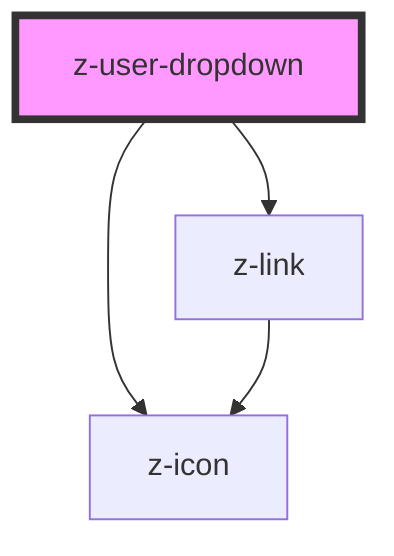

# z-user-dropdown

<!-- Auto Generated Below -->

## Properties

| Property      | Attribute     | Description                                     | Type                   | Default     |
| ------------- | ------------- | ----------------------------------------------- | ---------------------- | ----------- |
| `buttonid`    | `buttonid`    | unique button id                                | `string`               | `undefined` |
| `islogged`    | `islogged`    |                                                 | `boolean`              | `undefined` |
| `menucontent` | `menucontent` | Json stringified or array to fill menu dropdown | `MenuItem[] \| string` | `undefined` |
| `nomeutente`  | `nomeutente`  | user name text                                  | `string`               | `undefined` |

## Dependencies

### Depends on

- [z-icon](../icons/z-icon)
- [z-link](../navigation/z-link)

### Graph

----------------------------------------------

*Built with [StencilJS](https://stenciljs.com/)*
