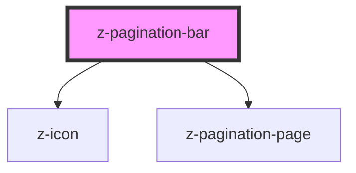

# z-pagination-bar

# This component is deprecated and will be removed from the library starting 01 October 2022.

<!-- readme-group="pagination" -->

```html
<z-pagination-bar
  pages="20"
  visiblepages="5"
  currentpage="2"
></z-pagination-bar>
<z-pagination-bar
  pages="20"
  visiblepages="11"
  currentpage="6"
></z-pagination-bar>
```

<!-- Auto Generated Below -->

## Properties

| Property         | Attribute      | Description                                           | Type       | Default     |
| ---------------- | -------------- | ----------------------------------------------------- | ---------- | ----------- |
| `currentpage`    | `currentpage`  | current displayed page (mutable)                      | `number`   | `1`         |
| `historyraw`     | `historyraw`   | json stringified history of visited pages (optional)  | `string`   | `undefined` |
| `listhistoryrow` | --             | array of history of visited pages (mutable, optional) | `number[]` | `[]`        |
| `pages`          | `pages`        | pages number                                          | `number`   | `undefined` |
| `startpage`      | `startpage`    | initial page (mutable)                                | `number`   | `1`         |
| `visiblepages`   | `visiblepages` | number of visible pages                               | `number`   | `undefined` |

## Events

| Event              | Description                                             | Type               |
| ------------------ | ------------------------------------------------------- | ------------------ |
| `addPageToHistory` | emitted on adding page to isvisited array, returns page | `CustomEvent<any>` |
| `changeStartPage`  | emitted on start page change, returns startpage         | `CustomEvent<any>` |
| `goToPage`         | emitted on page number click, returns page              | `CustomEvent<any>` |

## Dependencies

### Depends on

- [z-icon](../../../components/icons/z-icon)
- [z-pagination-page](../z-pagination-page)

### Graph



---

_Built with [StencilJS](https://stenciljs.com/)_
