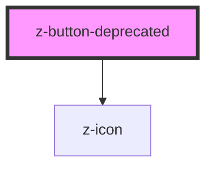

# z-button

# This component is deprecated and will be removed from the library starting 01 October 2022, please use z-button component instead.

<!-- readme-group="buttons" -->

```html
<z-button
  label="button"
  type="primary"
></z-button>
<z-button
  label="button"
  type="primary"
  icon="download"
></z-button>
<z-button
  label="button"
  type="primary"
  isdisabled
  icon="download"
></z-button>
<z-button
  label="button"
  type="secondary"
></z-button>
<z-button
  label="button"
  type="secondary"
  isdisabled
></z-button>
<z-button
  label="button"
  type="tertiary"
></z-button>
<z-button
  label="button"
  type="tertiary"
  isdisabled
></z-button>
<z-button
  label="button"
  type="primary"
  issmall
></z-button>
<z-button
  label="button"
  type="primary"
  issmall
  icon="download"
></z-button>
<z-button
  label="button"
  type="primary"
  issmall
  isdisabled
  icon="download"
></z-button>
<z-button
  label="button"
  type="secondary"
  issmall
></z-button>
<z-button
  label="button"
  type="secondary"
  issmall
  isdisabled
></z-button>
<z-button
  label="button"
  type="tertiary"
  issmall
></z-button>
<z-button
  label="button"
  type="tertiary"
  issmall
  isdisabled
></z-button>
```

<!-- Auto Generated Below -->

## Properties

| Property   | Attribute  | Description                                                                                                | Type                                                                                                                              | Default                     |
| ---------- | ---------- | ---------------------------------------------------------------------------------------------------------- | --------------------------------------------------------------------------------------------------------------------------------- | --------------------------- |
| `disabled` | `disabled` | HTML button disabled attribute.                                                                            | `boolean`                                                                                                                         | `false`                     |
| `htmlid`   | `htmlid`   | Identifier, should be unique.                                                                              | `string`                                                                                                                          | `undefined`                 |
| `icon`     | `icon`     | `z-icon` name to use (optional).                                                                           | `string`                                                                                                                          | `undefined`                 |
| `issmall`  | `issmall`  | <span style="color:red">**[DEPRECATED]**</span> Use `size` prop.<br/><br/>Reduce button size (deprecated). | `boolean`                                                                                                                         | `false`                     |
| `name`     | `name`     | HTML button name attribute.                                                                                | `string`                                                                                                                          | `undefined`                 |
| `size`     | `size`     | Available sizes: `big`, `small` and `x-small`. Defaults to `big`.                                          | `(typeof ButtonSizeEnum)["x-small"] \| ButtonSizeEnum.big \| ButtonSizeEnum.small`                                                | `ButtonSizeEnum.big`        |
| `square`   | `square`   | Spy to render square button.                                                                               | `boolean`                                                                                                                         | `false`                     |
| `type`     | `type`     | HTML button type attribute.                                                                                | `string`                                                                                                                          | `ButtonTypeEnum.button`     |
| `variant`  | `variant`  | Graphical variant: `primary`, `secondary`, `tertiary`, `dark-bg`. Defaults to `primary`.                   | `(typeof ButtonVariantEnum)["dark-bg"] \| ButtonVariantEnum.primary \| ButtonVariantEnum.secondary \| ButtonVariantEnum.tertiary` | `ButtonVariantEnum.primary` |

## Slots

| Slot | Description  |
| ---- | ------------ |
|      | button label |

## Dependencies

### Depends on

- [z-icon](../../components/icons/z-icon)

### Graph



---

_Built with [StencilJS](https://stenciljs.com/)_
