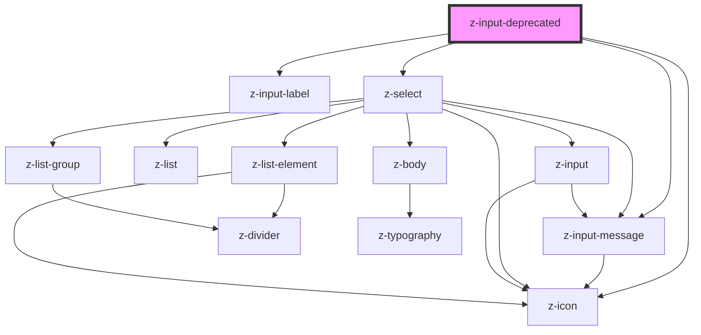

# z-input-deprecated

<!-- readme-group="input" -->

```html
<!-- type text -->
<z-input-deprecated
  label="default"
  placeholder="Cerca Autore"
></z-input-deprecated>
<z-input-deprecated
  label="filled"
  value="testo testo testo"
></z-input-deprecated>
<z-input-deprecated
  label="disabled"
  placeholder="placeholder"
  disabled
  value="i'm disabled"
></z-input-deprecated>
<z-input-deprecated
  label="readonly"
  placeholder="placeholder"
  readonly
  value="i'm read-only"
></z-input-deprecated>
<z-input-deprecated
  label="success"
  placeholder="placeholder"
  status="success"
  message="message message"
  value=""
></z-input-deprecated>
<z-input-deprecated
  label="error"
  placeholder="placeholder"
  status="error"
  message="message message"
  value="testo"
></z-input-deprecated>
<z-input-deprecated
  label="warning"
  placeholder="placeholder"
  status="warning"
  message="message message message message message message message message message message message message message message message message message message"
></z-input-deprecated>
<z-input-deprecated
  label="message"
  placeholder="placeholder"
  message="helper message"
></z-input-deprecated>

<!-- type textarea -->
<z-input-deprecated type="textarea"></z-input-deprecated>
<z-input-deprecated
  type="textarea"
  label="default"
  placeholder="Cerca Autore"
></z-input-deprecated>
<z-input-deprecated
  type="textarea"
  label="filled"
  value="testo testo testo"
></z-input-deprecated>
<z-input-deprecated
  type="textarea"
  label="disabled"
  placeholder="placeholder"
  disabled
  value="i'm disabled"
></z-input-deprecated>
<z-input-deprecated
  type="textarea"
  label="readonly"
  placeholder="placeholder"
  readonly
  value="i'm read-only"
></z-input-deprecated>
<z-input-deprecated
  type="textarea"
  label="success"
  placeholder="placeholder"
  status="success"
  message="message message"
  value=""
></z-input-deprecated>
<z-input-deprecated
  type="textarea"
  label="error"
  placeholder="placeholder"
  status="error"
  message="message message"
  value="testo"
></z-input-deprecated>
<z-input-deprecated
  type="textarea"
  label="warning"
  placeholder="placeholder"
  status="warning"
  message="message message"
></z-input-deprecated>
<z-input-deprecated
  type="textarea"
  label="message"
  placeholder="placeholder"
  message="helper message"
></z-input-deprecated>

<!-- type checkbox -->
<z-input-deprecated
  type="checkbox"
  htmlid="check1"
></z-input-deprecated>
<z-input-deprecated
  type="checkbox"
  htmlid="check2"
  label="this is a checkbox"
  checked="true"
></z-input-deprecated>
<z-input-deprecated
  type="checkbox"
  htmlid="check4"
  value="value"
  disabled="true"
  label="disabled"
  labelafter="false"
></z-input-deprecated>
<z-input-deprecated
  type="checkbox"
  htmlid="check5"
  value="value"
  readonly="true"
  label="read-only"
></z-input-deprecated>
```

<!-- Auto Generated Below -->


## Properties

| Property        | Attribute       | Description                                                                                         | Type                                                                                                                                                                                               | Default              |
| --------------- | --------------- | --------------------------------------------------------------------------------------------------- | -------------------------------------------------------------------------------------------------------------------------------------------------------------------------------------------------- | -------------------- |
| `ariaLabel`     | `aria-label`    | the input aria-label                                                                                | `string`                                                                                                                                                                                           | `""`                 |
| `autocomplete`  | `autocomplete`  | the input has autocomplete option (optional): available for select, input                           | `boolean \| string`                                                                                                                                                                                | `undefined`          |
| `checked`       | `checked`       | checked: available for checkbox, radio                                                              | `boolean`                                                                                                                                                                                          | `false`              |
| `disabled`      | `disabled`      | the input is disabled                                                                               | `boolean`                                                                                                                                                                                          | `false`              |
| `hasclearicon`  | `hasclearicon`  | render clear icon when typing (optional): available for text                                        | `boolean`                                                                                                                                                                                          | `true`               |
| `hasmessage`    | `hasmessage`    | show input helper message (optional): available for text, password, number, email, textarea, select | `boolean`                                                                                                                                                                                          | `true`               |
| `htmlid`        | `htmlid`        | the id of the input element                                                                         | `string`                                                                                                                                                                                           | ``id-${randomId()}`` |
| `htmltitle`     | `htmltitle`     | the input html title (optional)                                                                     | `string`                                                                                                                                                                                           | `undefined`          |
| `icon`          | `icon`          | render icon (optional): available for text, select                                                  | `string`                                                                                                                                                                                           | `undefined`          |
| `items`         | `items`         | items (optional): available for select                                                              | `SelectItem[] \| string`                                                                                                                                                                           | `undefined`          |
| `label`         | `label`         | the input label                                                                                     | `string`                                                                                                                                                                                           | `undefined`          |
| `labelafter`    | `labelafter`    | the input label position: available for checkbox, radio                                             | `boolean`                                                                                                                                                                                          | `true`               |
| `message`       | `message`       | input helper message (optional): available for text, password, number, email, textarea, select      | `string`                                                                                                                                                                                           | `undefined`          |
| `multiple`      | `multiple`      | multiple options can be selected (optional): available for select                                   | `boolean`                                                                                                                                                                                          | `false`              |
| `name`          | `name`          | the input name                                                                                      | `string`                                                                                                                                                                                           | `undefined`          |
| `placeholder`   | `placeholder`   | the input placeholder (optional)                                                                    | `string`                                                                                                                                                                                           | `undefined`          |
| `readonly`      | `readonly`      | the input is readonly                                                                               | `boolean`                                                                                                                                                                                          | `false`              |
| `required`      | `required`      | the input is required (optional): available for text, password, number, email, textarea, checkbox   | `boolean`                                                                                                                                                                                          | `false`              |
| `status`        | `status`        | the input status (optional): available for text, password, number, email, textarea, select          | `InputStatus.ERROR \| InputStatus.SUCCESS \| InputStatus.WARNING`                                                                                                                                  | `undefined`          |
| `type`          | `type`          | input types                                                                                         | `InputType.CHECKBOX \| InputType.EMAIL \| InputType.NUMBER \| InputType.PASSWORD \| InputType.RADIO \| InputType.SEARCH \| InputType.TEL \| InputType.TEXT \| InputType.TEXTAREA \| InputType.URL` | `undefined`          |
| `typingtimeout` | `typingtimeout` | timeout setting before trigger `inputChange` event (optional): available for text, textarea         | `number`                                                                                                                                                                                           | `300`                |
| `value`         | `value`         | the input value                                                                                     | `string`                                                                                                                                                                                           | `undefined`          |


## Events

| Event          | Description                                                                                                          | Type               |
| -------------- | -------------------------------------------------------------------------------------------------------------------- | ------------------ |
| `inputChange`  | Emitted on input value change, returns value, keycode, validity                                                      | `CustomEvent<any>` |
| `inputCheck`   | Emitted on checkbox check/uncheck, returns id, checked, type, name, value, validity                                  | `CustomEvent<any>` |
| `optionSelect` | Emitted on select option selection, returns select id, selected item id (or array of selected items ids if multiple) | `CustomEvent<any>` |
| `startTyping`  | Emitted when user starts typing                                                                                      | `CustomEvent<any>` |
| `stopTyping`   | Emitted when user stops typing, returns value, validity                                                              | `CustomEvent<any>` |


## Methods

### `getValue() => Promise<string | string[]>`

get the input value

#### Returns

Type: `Promise<string | string[]>`


### `isChecked() => Promise<boolean>`

get checked status

#### Returns

Type: `Promise<boolean>`


### `setValue(value: string | string[]) => Promise<void>`

set the input value

#### Returns

Type: `Promise<void>`


## Dependencies

### Depends on

- [z-input-label](../z-input-label)
- [z-icon](../../components/icons/z-icon)
- [z-input-message](../../components/inputs/z-input-message)
- [z-select](../../components/inputs/z-select)

### Graph


----------------------------------------------

*Built with [StencilJS](https://stenciljs.com/)*
