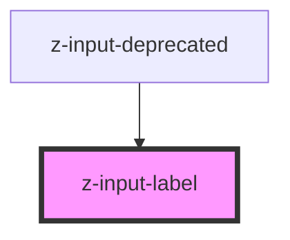

# z-input-label

<!-- Auto Generated Below -->

## Properties

| Property   | Attribute  | Description              | Type      | Default     |
| ---------- | ---------- | ------------------------ | --------- | ----------- |
| `disabled` | `disabled` | the label is disabled    | `boolean` | `false`     |
| `htmlfor`  | `htmlfor`  | the label is attached to | `string`  | `undefined` |
| `value`    | `value`    | the label value          | `string`  | `undefined` |

## Dependencies

### Used by

 - [z-input-deprecated](../z-input-deprecated)

### Graph

----------------------------------------------

*Built with [StencilJS](https://stenciljs.com/)*
