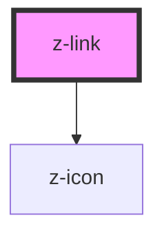

# z-link

<!-- readme-group="link" -->

```html
<z-link>z-link</z-link>
<z-link icon="download">z-link</z-link>
<z-link isdisabled>z-link</z-link>
<z-link isactive>z-link</z-link>
<z-link iswhite>z-link</z-link>
```

<!-- Auto Generated Below -->


> **[DEPRECATED]** - use a native `<a>` with the `z-link` CSS class instead

## Properties

| Property       | Attribute      | Description                        | Type                                           | Default     |
| -------------- | -------------- | ---------------------------------- | ---------------------------------------------- | ----------- |
| `big`          | `big`          | big link version                   | `boolean`                                      | `false`     |
| `href`         | `href`         | link url (optional)                | `string`                                       | `undefined` |
| `htmlid`       | `htmlid`       | link id (optional)                 | `string`                                       | `undefined` |
| `htmltabindex` | `htmltabindex` | tabindex link attribute (optional) | `number`                                       | `0`         |
| `icon`         | `icon`         | link icon name (optional)          | `string`                                       | `undefined` |
| `iconposition` | `iconposition` | link icon position (optional)      | `"left" \| "right"`                            | `"left"`    |
| `isactive`     | `isactive`     | active link flag (optional)        | `boolean`                                      | `false`     |
| `isdisabled`   | `isdisabled`   | disable link flag (optional)       | `boolean`                                      | `false`     |
| `iswhite`      | `iswhite`      | white variant flag (optional)      | `boolean`                                      | `false`     |
| `target`       | `target`       | link target (optional)             | `string`                                       | `"_self"`   |
| `textcolor`    | `textcolor`    | link text variant (optional)       | `"black" \| "inverse" \| "primary" \| "white"` | `"primary"` |
| `underline`    | `underline`    | draw underline on text (optional)  | `boolean`                                      | `false`     |


## Events

| Event        | Description                           | Type               |
| ------------ | ------------------------------------- | ------------------ |
| `zLinkClick` | emitted on link click, returns linkId | `CustomEvent<any>` |


## Slots

| Slot | Description  |
| ---- | ------------ |
|      | link content |


## Dependencies

### Depends on

- [z-icon](../../components/icons/z-icon)

### Graph


----------------------------------------------

*Built with [StencilJS](https://stenciljs.com/)*
