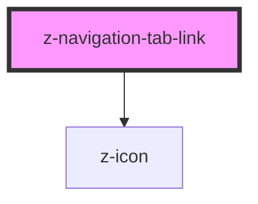

# z-navigation-tab

<!-- readme-group="pagination" -->

```html
<z-navigation-tab
  pageId="10"
  value="10"
></z-navigation-tab>
<z-navigation-tab
  pageId="10"
  value="10"
  isdisabled
></z-navigation-tab>
<z-navigation-tab
  pageId="10"
  value="10"
  isselected
  isvisited
></z-navigation-tab>
```

<!-- Auto Generated Below -->


> **[DEPRECATED]** Use a native `<a>` instead.

## Properties

| Property       | Attribute       | Description                                                                                                                                                                                                | Type                                                                         | Default                                |
| -------------- | --------------- | ---------------------------------------------------------------------------------------------------------------------------------------------------------------------------------------------------------- | ---------------------------------------------------------------------------- | -------------------------------------- |
| `ariaControls` | `aria-controls` | `aria-controls` attribute of the tab. Identifies the element (with `role=tabpanel`) whose contents or presence are controlled by this tab. The value must be the `id` of the element it controls.          | `string`                                                                     | `undefined`                            |
| `disabled`     | `disabled`      | Whether the tab is disabled.                                                                                                                                                                               | `boolean`                                                                    | `false`                                |
| `href`         | `href`          | Url to set to the anchor element.                                                                                                                                                                          | `string`                                                                     | `undefined`                            |
| `htmlTitle`    | `html-title`    | Html title attribute for the anchor element.                                                                                                                                                               | `string`                                                                     | `undefined`                            |
| `icon`         | `icon`          | Name of the icon to use. The `filled` version will be automatically used (if found) when the tab is `selected`.                                                                                            | `string`                                                                     | `undefined`                            |
| `label`        | `label`         | Label to show in the tab.                                                                                                                                                                                  | `string`                                                                     | `undefined`                            |
| `orientation`  | `orientation`   | Tab orientation. Do not set this manually: `z-navigation-tabs` will handle this.                                                                                                                           | `NavigationTabsOrientation.HORIZONTAL \| NavigationTabsOrientation.VERTICAL` | `NavigationTabsOrientation.HORIZONTAL` |
| `selected`     | `selected`      | Whether the tab is selected.                                                                                                                                                                               | `boolean`                                                                    | `false`                                |
| `size`         | `size`          | Tab size. Do not set this manually: `z-navigation-tabs` will handle this.                                                                                                                                  | `NavigationTabsSize.BIG \| NavigationTabsSize.SMALL`                         | `NavigationTabsSize.BIG`               |
| `tabId`        | `tab-id`        | <span style="color:red">**[DEPRECATED]**</span> Use native `id` attribute instead<br/><br/>`id` attribute of the tab. Set this id to the `aria-labelledby` attribute of the controlled `tabpanel` element. | `string`                                                                     | `undefined`                            |
| `target`       | `target`        | Html `target` attribute for the anchor element.                                                                                                                                                            | `string`                                                                     | `undefined`                            |


## Events

| Event      | Description                | Type               |
| ---------- | -------------------------- | ------------------ |
| `selected` | The tab has been selected. | `CustomEvent<any>` |


## Dependencies

### Depends on

- [z-icon](../../components/icons/z-icon)

### Graph


----------------------------------------------

*Built with [StencilJS](https://stenciljs.com/)*
