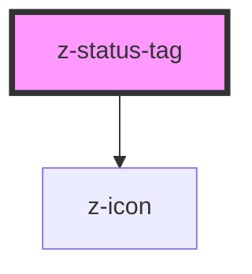

# z-status-tag

# This component is deprecated and will be removed from the library starting 09 August 2022.

<!-- Auto Generated Below -->

## Properties

| Property     | Attribute    | Description                                   | Type                                                                                                                                | Default                   |
| ------------ | ------------ | --------------------------------------------- | ----------------------------------------------------------------------------------------------------------------------------------- | ------------------------- |
| `expandable` | `expandable` | [optional] Hide the text and show it on hover | `boolean`                                                                                                                           | `undefined`               |
| `icon`       | `icon`       | [optional] Status tag icon                    | `string`                                                                                                                            | `undefined`               |
| `status`     | `status`     | [optional] Status tag color                   | `StatusTagStatus.DEFAULT \| StatusTagStatus.ERROR \| StatusTagStatus.NEUTRAL \| StatusTagStatus.SUCCESS \| StatusTagStatus.WARNING` | `StatusTagStatus.DEFAULT` |
| `text`       | `text`       | [optional] Status tag text                    | `string`                                                                                                                            | `undefined`               |
| `variant`    | `variant`    | [optional] Status tag style                   | `ThemeVariant.DARK \| ThemeVariant.LIGHT`                                                                                           | `undefined`               |

## Dependencies

### Depends on

- [z-icon](../../components/icons/z-icon)

### Graph

---

_Built with [StencilJS](https://stenciljs.com/)_
