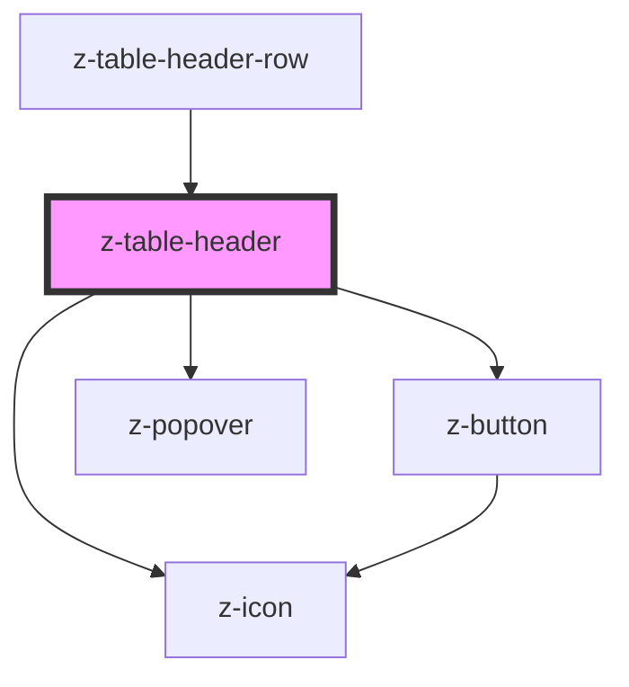

# z-table-header

<!-- Auto Generated Below -->

> **[DEPRECATED]** 

## Properties

| Property               | Attribute                | Description                                                  | Type                                                       | Default     |
| ---------------------- | ------------------------ | ------------------------------------------------------------ | ---------------------------------------------------------- | ----------- |
| `columnId`             | `column-id`              | Column ID                                                    | `string`                                                   | `undefined` |
| `defaultSortDirection` | `default-sort-direction` | [Optional] Default sort order                                | `"asc" \| "desc" \| "none"`                                | `"asc"`     |
| `padding`              | `padding`                | Set padding size of cell, if special 0px padding will be set | `"large" \| "medium" \| "small" \| "special" \| "x-small"` | `"medium"`  |
| `showButton`           | `show-button`            | [Optional] Show contextual menu button                       | `boolean`                                                  | `undefined` |
| `sortDirection`        | `sort-direction`         | Sort direction                                               | `"asc" \| "desc" \| "none"`                                | `"none"`    |
| `sortable`             | `sortable`               | [Optional] Make the header sortable                          | `boolean`                                                  | `undefined` |

## Events

| Event  | Description                     | Type               |
| ------ | ------------------------------- | ------------------ |
| `sort` | [Optional] callback for sorting | `CustomEvent<any>` |

## Dependencies

### Used by

 - [z-table-header-row](../z-table-header-row)

### Depends on

- [z-icon](../../../components/icons/z-icon)
- [z-button](../../../components/buttons/z-button)
- [z-popover](../../../components/z-popover)

### Graph

----------------------------------------------

*Built with [StencilJS](https://stenciljs.com/)*
