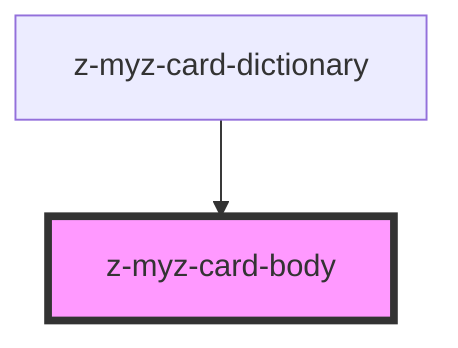

# z-myz-card-body

<!-- readme-group="card" -->

```html
<z-myz-card-body>{alert slot}{cover slot}</z-myz-card-body>
```

<!-- Auto Generated Below -->

## Slots

| Slot      | Description     |
| --------- | --------------- |
| `"alert"` | card alert slot |
| `"cover"` | book cover slot |

## Dependencies

### Used by

- [z-myz-card-dictionary](../z-myz-card-dictionary)

### Graph



---

_Built with [StencilJS](https://stenciljs.com/)_
