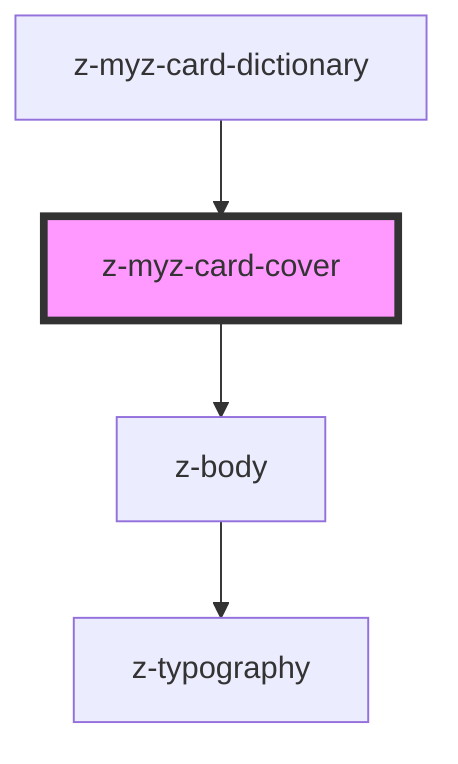

# z-myz-card-cover

<!-- readme-group="card" -->
```html
<z-myz-card-cover slot="cover" titolo="titolo" img="https://staticmy.zanichelli.it/catalogo/assets/m40001.9788808720740.jpg" />
<z-myz-card-cover slot="cover" titolo="titolo" img="https://staticmy.zanichelli.it/catalogo/assets/m40001.9788808720740.jpg" faded=true />
<z-myz-card-cover slot="cover" titolo="titolo" img="https://staticmy.zanichelli.it/catalogo/assets/m40001.9788808720740.jpg" faded=true defaultimg="/assets/fallback_image.jpg" />
```

<!-- Auto Generated Below -->


## Properties

| Property       | Attribute        | Description                | Type      | Default     |
| -------------- | ---------------- | -------------------------- | --------- | ----------- |
| `defaultimg`   | `defaultimg`     | default error image source | `string`  | `undefined` |
| `faded`        | `faded`          | faded status               | `boolean` | `undefined` |
| `img`          | `img`            | image source               | `string`  | `undefined` |
| `outOfCatalog` | `out-of-catalog` | out of catalog flag        | `boolean` | `true`      |
| `titolo`       | `titolo`         | cover alt title            | `string`  | `undefined` |


## Dependencies

### Used by

 - [z-myz-card-dictionary](../z-myz-card-dictionary)

### Depends on

- [z-body](../../../../components/typography/z-body)

### Graph


----------------------------------------------

*Built with [StencilJS](https://stenciljs.com/)*
