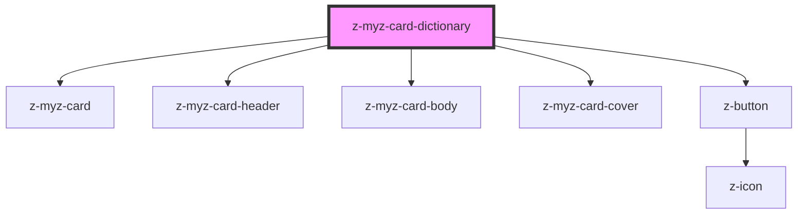

# z-myz-card-dictionary

<!-- Auto Generated Below -->

## Properties

| Property          | Attribute         | Description       | Type      | Default     |
| ----------------- | ----------------- | ----------------- | --------- | ----------- |
| `cover`           | `cover`           | card cover        | `string`  | `undefined` |
| `disabled`        | `disabled`        | card is disabled  | `boolean` | `false`     |
| `flipbuttonlabel` | `flipbuttonlabel` | flip button label | `string`  | `"INFO"`    |
| `flipped`         | `flipped`         | card is flipped   | `boolean` | `false`     |
| `hideinfobtn`     | `hideinfobtn`     | hide info button  | `boolean` | `false`     |
| `name`            | `name`            | card title        | `string`  | `undefined` |

## Events

| Event         | Description          | Type               |
| ------------- | -------------------- | ------------------ |
| `cardFlipped` | when card is flipped | `CustomEvent<any>` |

## Slots

| Slot     | Description       |
| -------- | ----------------- |
|          | generic card slot |
| `"info"` | flipped card info |

## Dependencies

### Depends on

- [z-myz-card](../z-myz-card)
- [z-myz-card-header](../z-myz-card-header)
- [z-myz-card-body](../z-myz-card-body)
- [z-myz-card-cover](../z-myz-card-cover)
- [z-button](../../../../components/z-button)

### Graph

----------------------------------------------

*Built with [StencilJS](https://stenciljs.com/)*
