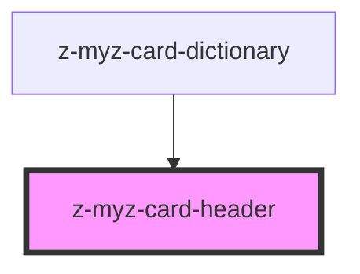

# z-myz-card-header

<!-- readme-group="card" -->

```html
<z-myz-card-header titolo="titolo titolo titolotitolo titolo titolo titolo"></z-myz-card-header>
<z-myz-card-header
  faded="true"
  titolo="titolo titolo titolotitolo titolo titolo titolo"
></z-myz-card-header>
<z-myz-card-header
  titolo="titolo titolo titolotitolo titolo titolo titolo"
  cardtype="reale"
></z-myz-card-header>
```

<!-- Auto Generated Below -->


## Properties

| Property   | Attribute  | Description                     | Type                                                                               | Default     |
| ---------- | ---------- | ------------------------------- | ---------------------------------------------------------------------------------- | ----------- |
| `cardtype` | `cardtype` | card graphic variant (optional) | `LicenseType.REAL \| LicenseType.TEMP \| LicenseType.TRIAL \| LicenseType.VIRTUAL` | `undefined` |
| `faded`    | `faded`    | faded status                    | `boolean`                                                                          | `undefined` |
| `titolo`   | `titolo`   | volume title                    | `string`                                                                           | `undefined` |


## Slots

| Slot     | Description           |
| -------- | --------------------- |
| `"icon"` | card header icon slot |


## Dependencies

### Used by

 - [z-myz-card-dictionary](../z-myz-card-dictionary)

### Graph


----------------------------------------------

*Built with [StencilJS](https://stenciljs.com/)*
