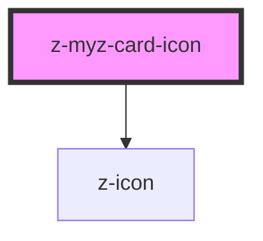

# z-myz-card-icon

<!-- readme-group="card" -->

```html
<z-myz-card-icon
  icon="book-minus"
  slot="icon"
/>
<z-myz-card-icon
  icon="book-minus"
  isdisbled="true"
  slot="icon"
/>
```

<!-- Auto Generated Below -->


## Properties

| Property     | Attribute    | Description             | Type      | Default     |
| ------------ | ------------ | ----------------------- | --------- | ----------- |
| `ariaLabel`  | `aria-label` | description of the icon | `string`  | `""`        |
| `icon`       | `icon`       | icon name               | `string`  | `undefined` |
| `isdisabled` | `isdisabled` | disabled status flag    | `boolean` | `false`     |


## Dependencies

### Depends on

- [z-icon](../../../../components/z-icon)

### Graph


----------------------------------------------

*Built with [StencilJS](https://stenciljs.com/)*
