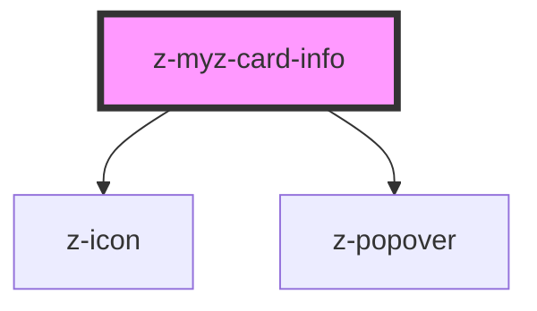

# z-myz-card-info

<!-- Auto Generated Below -->

## Properties

| Property       | Attribute      | Description                        | Type                                                                                                                                                           | Default     |
| -------------- | -------------- | ---------------------------------- | -------------------------------------------------------------------------------------------------------------------------------------------------------------- | ----------- |
| `data`         | `data`         | dictionary info                    | `string \| { author: string; year: string; title: string; description: string; onlineLicense: DictionaryLicenseData; offlineLicense: DictionaryLicenseData; }` | `undefined` |
| `htmltabindex` | `htmltabindex` | tabindex link attribute (optional) | `number`                                                                                                                                                       | `0`         |

## Events

| Event      | Description        | Type               |
| ---------- | ------------------ | ------------------ |
| `flipCard` | flip card to front | `CustomEvent<any>` |

## Slots

| Slot | Description |
| ---- | ----------- |
|      | content     |

## Dependencies

### Depends on

- [z-icon](../../../../components/z-icon)
- [z-popover](../../../../components/z-popover)

### Graph

----------------------------------------------

*Built with [StencilJS](https://stenciljs.com/)*
