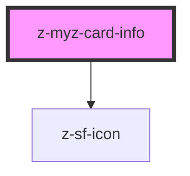

# z-myz-card-info

<!-- Auto Generated Below -->

## Properties

| Property       | Attribute      | Description                        | Type                                                                                                                                                               | Default     |
| -------------- | -------------- | ---------------------------------- | ------------------------------------------------------------------------------------------------------------------------------------------------------------------ | ----------- |
| `data`         | `data`         | dictionary info                    | `string \| { author: string; year: string; title: string; description: string; onlineLicense: SfDictionaryLicenseData; offlineLicense: SfDictionaryLicenseData; }` | `undefined` |
| `htmltabindex` | `htmltabindex` | tabindex link attribute (optional) | `number`                                                                                                                                                           | `0`         |

## Events

| Event      | Description        | Type               |
| ---------- | ------------------ | ------------------ |
| `flipCard` | flip card to front | `CustomEvent<any>` |

## Slots

| Slot | Description |
| ---- | ----------- |
|      | content     |

## Dependencies

### Depends on

- [z-sf-icon](../../../../components/z-sf-icon)

### Graph

```mermaid
graph TD;
  z-myz-card-info --> z-sf-icon
  style z-myz-card-info fill:#f9f,stroke:#333,stroke-width:4px
```

----------------------------------------------

*Built with [StencilJS](https://stenciljs.com/)*
