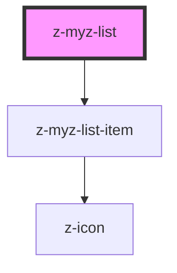

# z-list

<!-- readme-group="list" -->

```html
<z-myz-list
  inputrawdata='[{"text":"elemento lista","link":"http://www.google.it","listitemid":"id1","icon":"checkbox-checked"},{"text":"elemento lista","link":"http://www.google.it","listitemid":"id2","icon":"checkbox"},{"text":""}]'
></z-myz-list>
```

<!-- Auto Generated Below -->


## Properties

| Property       | Attribute      | Description                                    | Type         | Default     |
| -------------- | -------------- | ---------------------------------------------- | ------------ | ----------- |
| `inputrawdata` | `inputrawdata` | json stringified list data (mutable, optional) | `string`     | `undefined` |
| `list`         | --             | list item data (mutable, optional)             | `ListItem[]` | `undefined` |


## Dependencies

### Depends on

- [z-myz-list-item](../z-myz-list-item)

### Graph


----------------------------------------------

*Built with [StencilJS](https://stenciljs.com/)*
