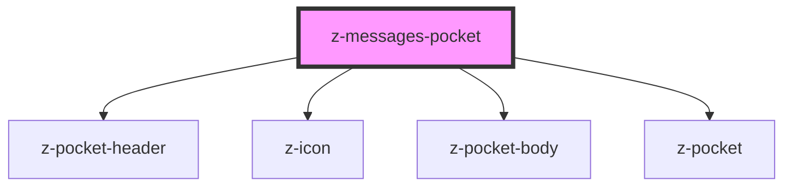

# z-messages-pocket

<!-- Auto Generated Below -->

## Properties

| Property   | Attribute  | Description        | Type                                                               | Default                |
| ---------- | ---------- | ------------------ | ------------------------------------------------------------------ | ---------------------- |
| `messages` | `messages` | number of messages | `number`                                                           | `undefined`            |
| `pocketid` | `pocketid` | pocket id          | `string`                                                           | `undefined`            |
| `status`   | `status`   | pocket status      | `PocketStatus.CLOSED \| PocketStatus.OPEN \| PocketStatus.PREVIEW` | `PocketStatus.PREVIEW` |

## Slots

| Slot | Description         |
| ---- | ------------------- |
|      | pocket body content |

## Dependencies

### Depends on

- [z-pocket-header](../z-pocket-header)
- [z-icon](../../../../components/z-icon)
- [z-pocket-body](../z-pocket-body)
- [z-pocket](../z-pocket)

### Graph

----------------------------------------------

*Built with [StencilJS](https://stenciljs.com/)*
