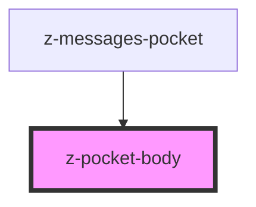

# z-pocket-body

<!-- Auto Generated Below -->

## Properties

| Property   | Attribute  | Description   | Type                                                                           | Default                    |
| ---------- | ---------- | ------------- | ------------------------------------------------------------------------------ | -------------------------- |
| `pocketid` | `pocketid` | pocket id     | `string`                                                                       | `undefined`                |
| `status`   | `status`   | pocket status | `PocketStatusEnum.CLOSED \| PocketStatusEnum.OPEN \| PocketStatusEnum.PREVIEW` | `PocketStatusEnum.PREVIEW` |

## Slots

| Slot | Description         |
| ---- | ------------------- |
|      | pocket body content |

## Dependencies

### Used by

 - [z-messages-pocket](../z-messages-pocket)

### Graph

----------------------------------------------

*Built with [StencilJS](https://stenciljs.com/)*
